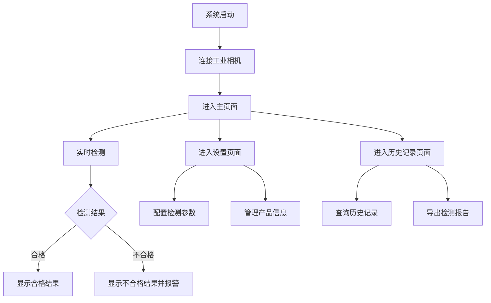

## 1. 产品概述
OpenHarmony 产品能效标签与缺陷检测系统是一个基于工业相机的实时检测系统，用于识别和校验产品能效标签信息，并检测标签的缺陷和位置。
- 主要用途是在工业生产线上实时监控产品能效标签的质量和位置，确保产品符合标准要求。
- 目标用户为工厂生产管理人员和质检人员，市场价值在于提高生产效率和产品质量。

## 2. 核心功能

### 2.1 用户角色
| 角色 | 注册方式 | 核心权限 |
|------|---------------------|------------------|
| 操作员 | 无需注册 | 查看检测结果，启动/停止检测 |
| 管理员 | 密码登录 | 配置检测参数，查看历史记录，导出报告 |

### 2.2 功能模块
1. **主页面**：实时检测界面，显示相机画面，检测结果，系统状态
2. **设置页面**：配置检测参数，产品型号信息管理
3. **历史记录页面**：查看历史检测结果，导出报告

### 2.3 页面详情
| 页面名称 | 模块名称 | 功能描述 |
|-----------|-------------|---------------------|
| 主页面 | 相机监控 | 显示工业相机实时画面，支持画面缩放和调整 |
| 主页面 | 检测结果 | 实时显示能效标签识别结果，包括数据信息和比对结果 |
| 主页面 | 缺陷检测 | 显示标签是否存在破损、污渍、褶皱等缺陷 |
| 主页面 | 位置检测 | 判断能效标签是否粘贴在规定位置 |
| 主页面 | 系统状态 | 显示系统运行状态，包括相机连接状态、检测速度等 |
| 设置页面 | 参数配置 | 配置检测精度、速度、相机参数等 |
| 设置页面 | 产品管理 | 添加、编辑、删除产品型号信息 |
| 历史记录页面 | 记录查询 | 按时间、产品型号等条件查询历史检测记录 |
| 历史记录页面 | 报告导出 | 导出检测报告为Excel或PDF格式 |

## 3. 核心流程
用户打开系统后，进入主页面，系统自动连接工业相机并开始实时检测。当产品通过相机视野时，系统识别能效标签上的数据信息，与预设的产品型号信息进行比对，同时检测标签是否存在缺陷和位置是否正确。检测结果实时显示在界面上，不合格产品会触发警报。管理员可以进入设置页面配置检测参数和管理产品信息，也可以进入历史记录页面查看和导出历史检测数据。

## 4. 用户界面设计
### 4.1 设计风格
- 主色调：深蓝色（#1a365d）和亮蓝色（#3182ce）
- 辅助色：绿色（#38a169）表示合格，红色（#e53e3e）表示不合格
- 按钮风格：圆角矩形，带有轻微的阴影效果
- 字体：无衬线字体，主标题18px，副标题16px，正文14px
- 布局风格：卡片式布局，清晰的信息层次，突出重要数据
- 图标风格：简洁现代的线性图标，使用蓝色系

### 4.2 页面设计概览
| 页面名称 | 模块名称 | UI元素 |
|-----------|-------------|-------------|
| 主页面 | 相机监控 | 占据页面左侧60%的区域，实时显示相机画面，带有缩放控制按钮 |
| 主页面 | 检测结果 | 页面右侧上方，卡片式布局，显示能效标签数据和比对结果 |
| 主页面 | 缺陷检测 | 页面右侧中部，卡片式布局，显示缺陷检测结果，带有可视化标记 |
| 主页面 | 位置检测 | 页面右侧下方，卡片式布局，显示位置检测结果，带有位置偏差数据 |
| 主页面 | 系统状态 | 页面底部，状态栏形式，显示相机连接状态、检测速度、系统运行时间 |
| 设置页面 | 参数配置 | 表单布局，带有滑块和输入框，实时预览效果 |
| 设置页面 | 产品管理 | 表格布局，支持添加、编辑、删除操作 |
| 历史记录页面 | 记录查询 | 搜索表单和过滤选项，表格显示历史记录 |
| 历史记录页面 | 报告导出 | 导出按钮，支持选择导出格式和时间范围 |

### 4.3 响应式设计
- 桌面优先设计，适配工业平板和显示器
- 支持触摸操作，适合在生产环境中使用
- 关键信息在小屏幕上优先显示
- 界面元素大小适合工业环境中的操作

### 4.4 3D场景指导
- 不适用，本系统主要是2D界面
