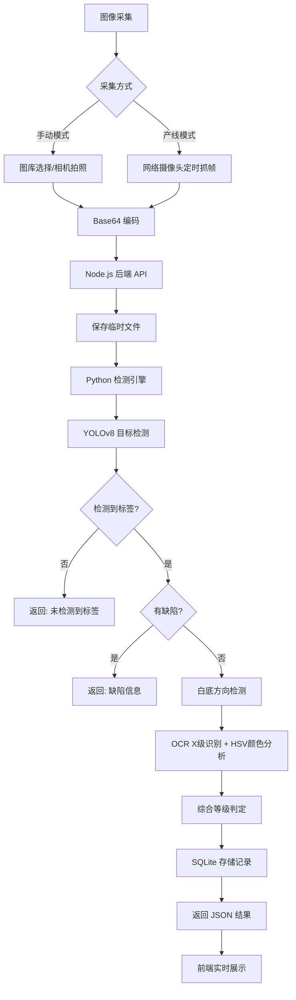
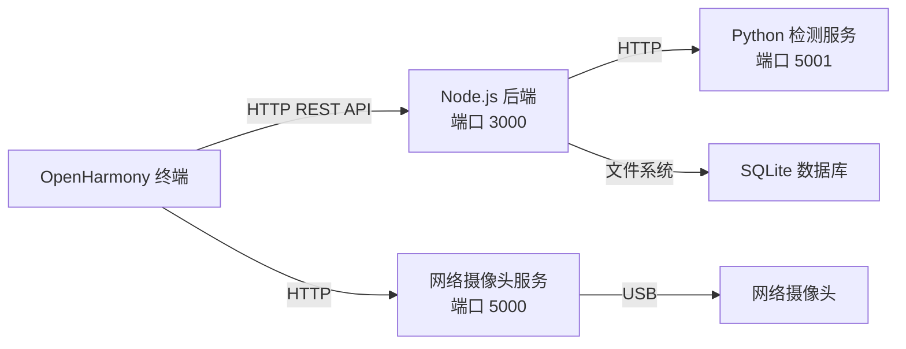

# MyGo 能效标签与缺陷检测系统 — 项目概要介绍

---

## 一、前言

在工业生产制造领域，产品能效标签的粘贴质量与信息准确性直接关系到产品合规性和市场准入。根据《能源效率标识管理办法》，所有列入目录的用能产品必须粘贴规范的能效标识，标注正确的能效等级。

传统人工质检方式效率低下、一致性差、成本高昂，且质检记录难以数字化追溯。随着国产操作系统 OpenHarmony 的快速发展和工业物联网的推进，基于智能终端的自动化质检需求日益迫切。

MyGo 项目应运而生，旨在将深度学习、计算机视觉与国产操作系统相结合，打造一套面向工业产线的智能能效标签检测系统，实现从"人工目检"到"机器智检"的跨越式升级。

---

## 二、创意描述

### 2.1 核心创意

MyGo 的核心创意是**将 AI 视觉检测能力部署到 OpenHarmony 国产平台**，形成一套"端-边"协同的轻量化质检方案：

- **端侧（OpenHarmony 工业平板）**：负责图像采集、实时展示、人机交互
- **边缘侧（PC/工控机）**：运行 YOLOv8 目标检测 + PaddleOCR 文字识别，提供高精度推理

### 2.2 设计理念

1. **双模式适配**：手动抽检 + 产线自动检测，覆盖从研发验证到批量生产的全场景
2. **多源图像接入**：支持本地相机、网络摄像头、图库选图、内置测试图片四种图像来源
3. **多策略融合检测**：OCR "X级" 优先 > 颜色 HSV 分析 > 纯数字 OCR，层层递进
4. **实时反馈**：检测过程中实时更新统计数据和记录状态，操作人员无需切换页面

---

## 三、功能简介

### 3.1 手动检测模式

| 功能 | 说明 |
|------|------|
| 图片选择 | 从图库选择或使用内置 13 张测试图片 |
| 相机拍照 | 调用系统相机实时拍摄标签照片 |
| 一键检测 | 上传图片至 AI 引擎，返回完整检测结果 |
| 结果展示 | 能效等级、合格判定、缺陷标签、位置偏差、能效参数、置信度 |

### 3.2 产线自动检测模式

| 功能 | 说明 |
|------|------|
| 网络摄像头预览 | 连接外置网络摄像头，实时预览画面 |
| 定时自动拍照 | 可配置 5s/10s/30s/60s 拍照间隔 |
| 实时统计面板 | 检测总数、通过率、缺陷分布、平均耗时实时刷新 |
| 检测记录列表 | 自动记录每次检测结果，支持点击查看详情 |
| 开始/暂停/结束 | 灵活控制检测流程 |

### 3.3 历史记录管理

| 功能 | 说明 |
|------|------|
| 多维筛选 | 按产品型号、日期范围、检测状态筛选 |
| 统计分析 | 总数、通过率、缺陷分布、位置偏差统计 |
| 记录管理 | 支持单条删除和清空全部 |
| 数据导出 | CSV 格式导出检测报告 |

### 3.4 AI 检测能力

| 能力 | 方法 | 说明 |
|------|------|------|
| 标签检测 | YOLOv8 目标检测 | 检测标签位置，识别 label/nor 类别 |
| 缺陷检测 | YOLOv8 分类 | 识别破损(break)、污渍(stain)、褶皱(wrinkle) |
| 等级识别（主） | OCR "X级" 模式 | 正则匹配 "1级"~"5级"，最可靠 |
| 等级识别（备） | HSV 颜色分析 | 分析五边形色条色调分布 |
| 参数提取 | PaddleOCR | 提取能效参数、待机功率等数值 |
| 图片纠偏 | 白底区域分析 | 检测上下白底高度，颠倒时自动旋转 180° |

---

## 四、特色综述

### 4.1 技术创新

1. **国产平台适配**：率先将深度学习质检方案部署到 OpenHarmony API 20 平台
2. **OCR 优先策略**：针对能效标签 "X级" 格式特征，设计三层 OCR 匹配（"X级" > 纯数字 > 关键词），大幅提升等级识别准确率
3. **白底纠偏算法**：无需 EXIF 信息，通过分析标签两块大白底区域的相对高度判断图片方向
4. **多模型融合**：YOLOv8 + PaddleOCR + OpenCV HSV 颜色分析三重技术互补

### 4.2 工程亮点

1. **常驻服务架构**：Python 检测模型只加载一次，后续请求直接推理，单次检测 2-3 秒
2. **轻量化部署**：YOLOv8n 模型仅 6.25MB，适合边缘端部署
3. **多源采集**：支持本地相机、网络摄像头、图库、测试图片四种输入
4. **实时 UI 刷新**：采用独立 @State 原始变量驱动统计面板，绕过 ArkUI ForEach 缓存问题

### 4.3 系统流程



---

## 五、开发工具与技术

### 5.1 开发环境

| 工具 | 版本/说明 |
|------|-----------|
| DevEco Studio | OpenHarmony 应用 IDE |
| OpenHarmony SDK | API 20 |
| Node.js | v18+ |
| Python | 3.10+ (Conda dl_train 环境) |
| VS Code | 后端 & Python 开发 |

### 5.2 技术栈

| 层级 | 技术 | 用途 |
|------|------|------|
| 前端框架 | OpenHarmony API 20 + ArkTS | 原生应用开发 |
| UI 框架 | ArkUI 声明式组件 | 界面渲染与交互 |
| 后端服务 | Node.js + Express.js | RESTful API 服务 |
| 数据库 | sql.js (SQLite WASM) | 轻量级本地存储 |
| 目标检测 | Ultralytics YOLOv8n | 标签定位与缺陷分类 |
| 文字识别 | PaddleOCR | 能效参数与等级文字提取 |
| 图像处理 | OpenCV + NumPy | HSV 颜色分析、图像变换 |
| 模型训练 | Roboflow + YOLOv8 | 数据标注与模型训练 |

### 5.3 项目结构

```
MyGo/
├── entry/                          # OpenHarmony 前端应用
│   └── src/main/ets/
│       ├── common/Interfaces.ets   # 类型定义
│       ├── pages/
│       │   ├── Index.ets           # 主页面（手动+产线双模式）
│       │   ├── CameraPage.ets      # 相机拍照页
│       │   ├── History.ets         # 历史记录页
│       │   └── Settings.ets        # 设置页
│       └── entryability/           # 应用入口
├── backend/                        # Node.js 后端
│   └── src/
│       ├── api/                    # REST 路由
│       ├── services/               # 业务逻辑
│       ├── db/database.js          # SQLite 数据库
│       ├── python/                 # AI 检测引擎
│       │   ├── detect_server.py    # 常驻检测服务 (端口 5001)
│       │   ├── detect_api.py       # 单次检测脚本
│       │   ├── webcam_server.py    # 网络摄像头服务 (端口 5000)
│       │   └── best.pt             # YOLOv8 模型 (6.25MB)
│       └── server.js               # Express 入口 (端口 3000)
└── docs/                           # 项目文档
```

---

## 六、应用对象

| 角色 | 使用场景 |
|------|----------|
| 产线质检员 | 使用产线模式对流水线产品进行实时自动检测 |
| 质量工程师 | 使用手动模式对新样品进行抽检和验证 |
| 质检主管 | 查看历史记录和统计分析，评估产线质量水平 |
| 设备维护人员 | 通过系统设置页面配置检测参数和摄像头连接 |
| 市场监管人员 | 使用手动模式对在售产品进行能效标签合规抽检 |

---

## 七、应用环境

### 7.1 硬件要求

| 组件 | 最低要求 |
|------|----------|
| 终端设备 | OpenHarmony API 20 工业平板或手机 |
| 后端服务器 | Windows/Linux PC，4GB RAM 以上 |
| 摄像头 | USB 网络摄像头（产线模式）或设备内置相机 |
| 网络 | 终端与后端在同一局域网 |

### 7.2 软件要求

| 软件 | 版本 |
|------|------|
| OpenHarmony | API 20 及以上 |
| Node.js | v18 及以上 |
| Python | 3.10 及以上 |
| Conda | 用于管理 Python 依赖环境 |

### 7.3 网络架构



---

## 八、结语

MyGo 能效标签与缺陷检测系统将深度学习技术与国产操作系统深度融合，提供了一套从图像采集、AI 分析到数据管理的完整质检解决方案。系统采用前后端分离架构，具备双模式检测、多策略等级识别、自动图片纠偏、实时统计刷新等特色功能，能够有效替代人工目检，提升质检效率和一致性。

未来，MyGo 将持续迭代，在模型精度、检测速度、用户体验等方面不断优化，为工业智能制造贡献力量。

---

## 项目文件清单

| 文件 | 说明 |
|------|------|
| 01_项目概要介绍 | 本文档 |
| 02_项目PPT | 演示汇报材料 |
| 03_项目详细方案 | 完整技术方案 |
| 04_需求分析文档 | 功能与非功能需求分析 |
| 05_系统设计文档 | 架构、模块、接口设计 |
| 06_测试案例 | 功能与接口测试用例 |
| 07_数据库设计文档 | 数据模型与表结构设计 |
| 08_测试报告 | 测试执行结果与分析 |
| 09_演示视频脚本 | 项目演示视频拍摄指南 |
