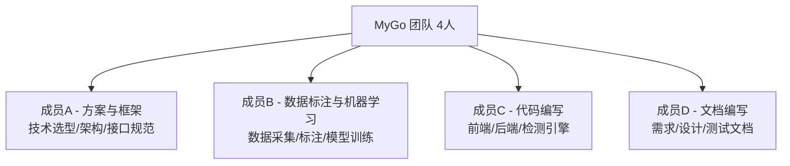
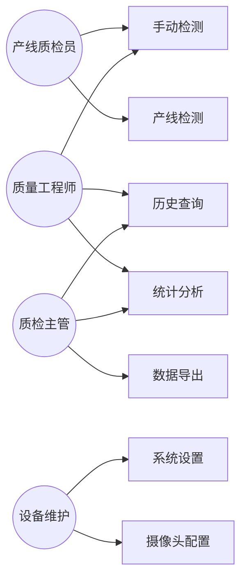
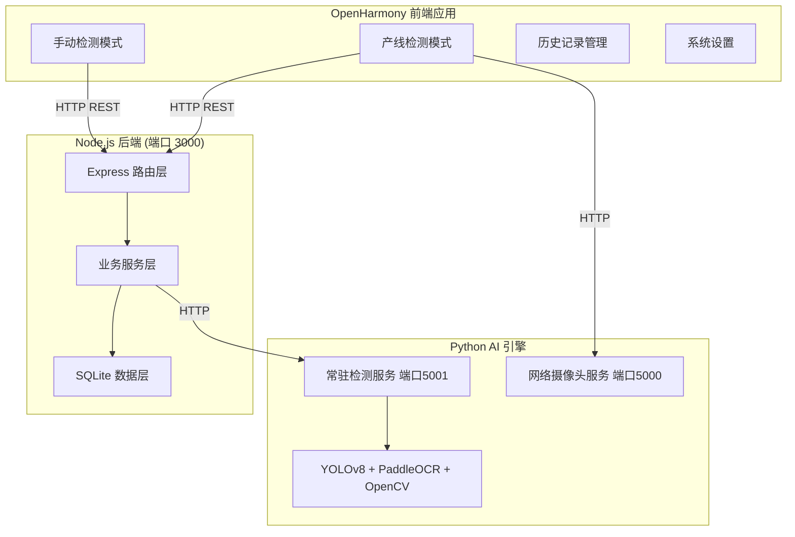
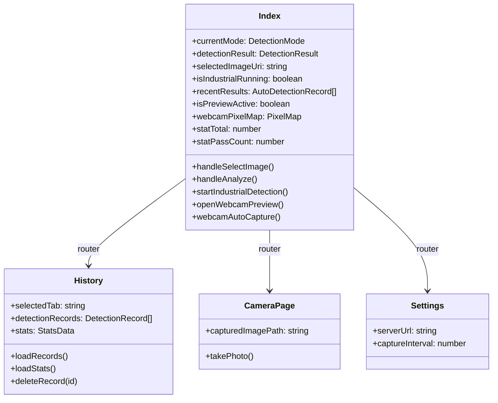
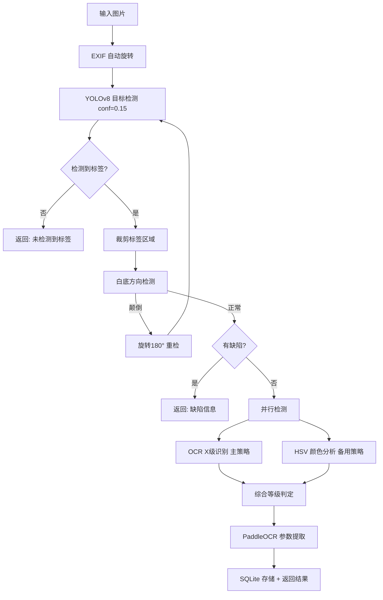
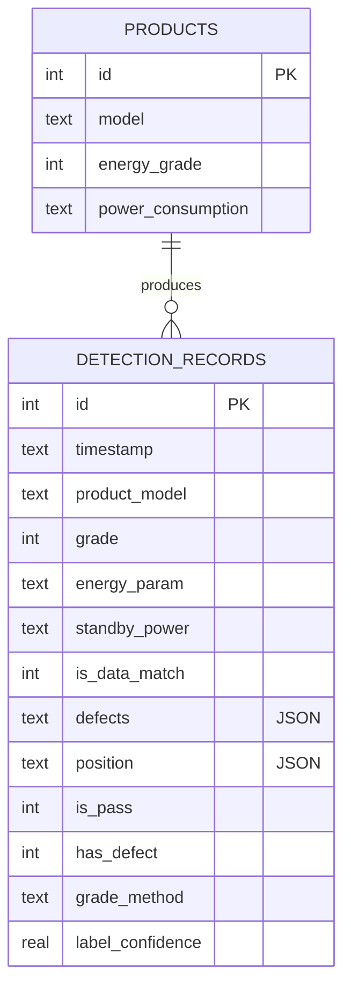
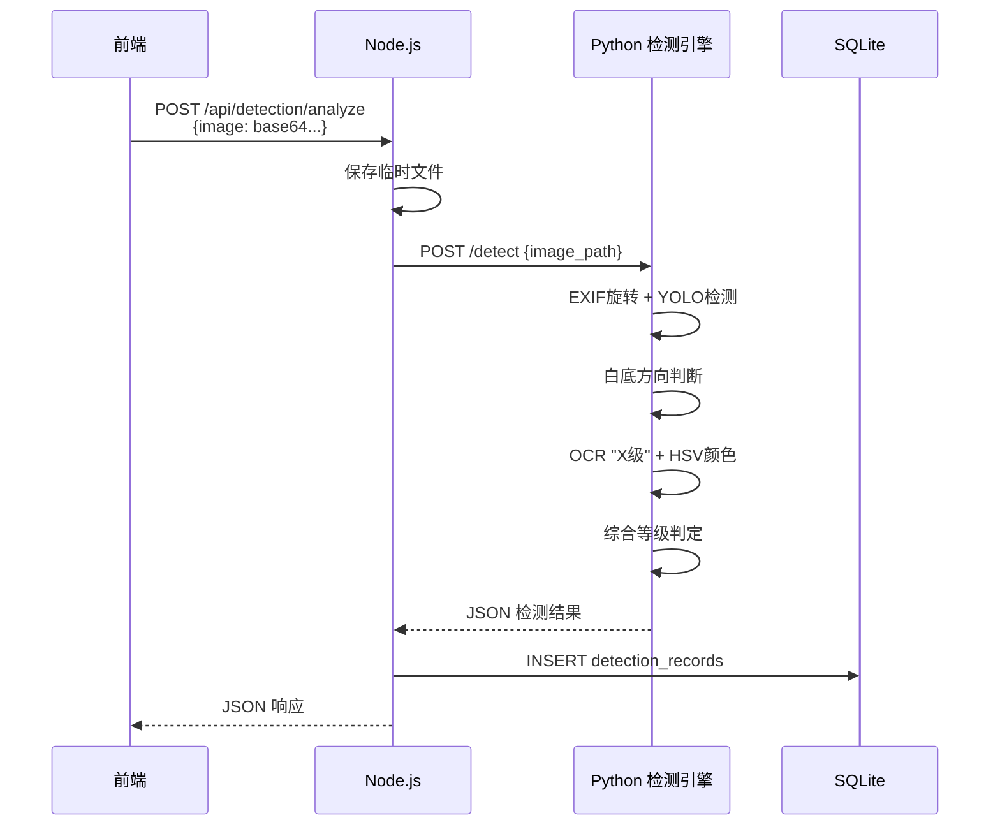
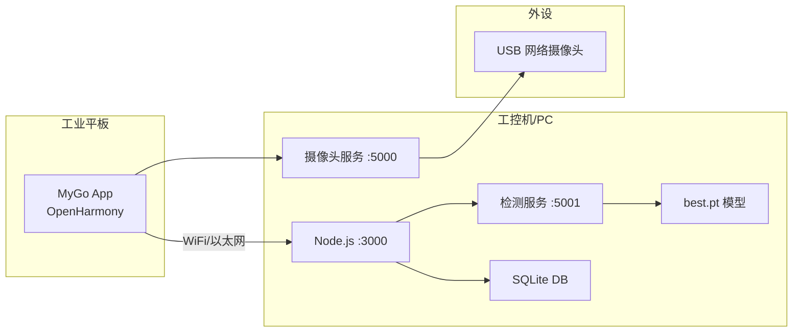

# MyGo 能效标签与缺陷检测系统 — 项目详细方案

---

## 一、项目概述

### 1.1 项目名称

MyGo 能效标签与缺陷检测系统

### 1.2 项目定位

基于 OpenHarmony 国产操作平台的工业级智能质检系统，利用 YOLOv8 深度学习模型 + PaddleOCR 文字识别 + OpenCV 图像处理技术，实现产品能效标签的自动化检测，覆盖标签识别、缺陷检测、位置校验、等级判定和参数提取等全流程质检需求。

### 1.3 项目周期

| 阶段 | 周期 | 主要工作 |
|------|------|----------|
| 需求分析与设计 | 2周 | 调研、需求文档、架构设计 |
| 核心功能开发 | 4周 | 前后端开发、检测引擎实现 |
| AI 模型训练 | 3周 | 数据采集标注、模型训练优化 |
| 系统集成测试 | 2周 | 联调、功能测试、性能优化 |

### 1.4 团队分工



---

## 二、需求分析

### 2.1 业务需求

| 编号 | 需求 | 优先级 |
|------|------|--------|
| BR-01 | 手动模式下单张图片检测 | 高 |
| BR-02 | 产线模式自动定时检测 | 高 |
| BR-03 | 能效等级自动识别(1-5级) | 高 |
| BR-04 | 标签缺陷自动检测 | 高 |
| BR-05 | 检测结果记录与追溯 | 中 |
| BR-06 | 统计分析与数据导出 | 中 |
| BR-07 | 图片自动纠偏 | 中 |

### 2.2 用例图



---

## 三、系统架构设计

### 3.1 整体架构



### 3.2 技术选型

| 层级 | 技术 | 选型理由 |
|------|------|----------|
| 前端 | OpenHarmony API 20 + ArkTS | 国产操作系统，工业平板原生支持 |
| UI | ArkUI 声明式组件 | 高性能渲染，声明式开发效率高 |
| 后端 | Node.js + Express | 异步I/O适合图片处理，生态丰富 |
| 数据库 | sql.js (SQLite WASM) | 零配置嵌入式，适合轻量级部署 |
| 目标检测 | Ultralytics YOLOv8n | 6.25MB轻量模型，边缘端友好 |
| OCR | PaddleOCR | 中文识别精度高，开源免费 |
| 图像处理 | OpenCV + NumPy | 成熟的计算机视觉库 |

### 3.3 服务端口规划

| 服务 | 端口 | 说明 |
|------|------|------|
| Node.js 后端 | 3000 | RESTful API 主服务 |
| Python 检测服务 | 5001 | 常驻 HTTP 服务，模型预加载 |
| 网络摄像头服务 | 5000 | USB 摄像头帧采集与分发 |

---

## 四、模块详细设计

### 4.1 前端模块



### 4.2 后端模块

| 模块 | 文件 | 职责 |
|------|------|------|
| 检测路由 | api/detectionRoutes.js | POST /api/detection/analyze |
| 历史路由 | api/historyRoutes.js | GET/DELETE /api/history |
| 产品路由 | api/productRoutes.js | GET /api/products |
| 检测服务 | services/detectionService.js | 调用Python引擎，优先常驻服务，回退spawn |
| 历史服务 | services/historyService.js | CRUD + 统计 + CSV导出 |
| 数据库 | db/database.js | sql.js 初始化、建表、持久化 |

### 4.3 AI 检测引擎

| 文件 | 功能 | 说明 |
|------|------|------|
| detect_server.py | 常驻HTTP服务 | 模型只加载一次，POST /detect 接口 |
| detect_api.py | 单次检测脚本 | spawn模式备用 |
| webcam_server.py | 摄像头帧服务 | /cameras, /frame_b64 接口 |
| best.pt | YOLOv8n模型 | 6.25MB，5类(label/nor/break/stain/wrinkle) |

---

## 五、AI 检测算法

### 5.1 检测流程



### 5.2 等级识别策略

**优先级**：OCR "X级" > OCR 纯数字 > HSV 颜色分析

| 策略 | 方法 | 可靠性 | 适用条件 |
|------|------|--------|----------|
| OCR "X级" | `re.search(r'([1-5])\s*级', text)` | 最高 | 文字清晰可识别 |
| OCR 纯数字 | 单个字符1-5, 置信度>0.85 | 较高 | 数字可识别但级字模糊 |
| HSV 颜色 | 色调直方图 + 多级ROI回退 | 中等 | 文字不可识别时兜底 |

### 5.3 白底纠偏算法

1. YOLO 裁剪标签区域 → 灰度图 → 二值化(阈值200)
2. 形态学去噪 → 找白色轮廓 → 取最大两个区域
3. 按y坐标分上下白底，比较高度
4. 上部白底高度 < 下部 × 0.85 → 判定颠倒 → 旋转180° 重新检测

### 5.4 模型训练

| 项目 | 参数 |
|------|------|
| 模型架构 | YOLOv8n (nano) |
| 训练数据 | 500+ 张标注图片 |
| 标注工具 | Roboflow |
| 类别 | label, nor, break, stain, wrinkle (5类) |
| 置信度阈值 | 0.15 |
| 模型大小 | 6.25MB |

---

## 六、数据设计

### 6.1 ER 图



### 6.2 JSON 字段结构

**defects 字段**：
```json
{"isDamaged": false, "isStained": false, "isWrinkled": false}
```

**position 字段**：
```json
{"isCorrect": true, "x": 320, "y": 240, "deviation": 3.5}
```

---

## 七、接口设计

### 7.1 API 总览

| 方法 | 路径 | 说明 |
|------|------|------|
| POST | /api/detection/analyze | 图片检测（body: {image: base64}） |
| GET | /api/history | 历史记录查询（支持过滤参数） |
| GET | /api/history/stats | 统计数据 |
| GET | /api/history/export/csv | CSV 导出 |
| DELETE | /api/history/:id | 删除单条记录 |
| DELETE | /api/history | 清空所有记录 |
| GET | /api/products | 产品列表 |
| GET | /health | 健康检查 |

### 7.2 检测时序图



---

## 八、部署方案

### 8.1 部署架构



### 8.2 启动步骤

```bash
# 1. 启动后端
cd backend && npm start

# 2. 启动检测服务
conda activate dl_train
python src/python/detect_server.py --port 5001

# 3. 启动网络摄像头服务（可选）
python src/python/webcam_server.py --port 5000
```

---

## 九、质量保障

### 9.1 测试策略

| 类型 | 工具/方法 | 覆盖范围 |
|------|-----------|----------|
| 功能测试 | 手动 + 内置测试图片13张 | 全功能覆盖 |
| 接口测试 | HTTP 工具 | 全部 API 端点 |
| 性能测试 | 计时统计 | 检测速度、稳定性 |
| 异常测试 | 边界输入 | 空图、损坏图、无标签图 |

### 9.2 质量指标

| 指标 | 目标 | 实测 |
|------|------|------|
| 功能测试通过率 | ≥ 90% | 94% |
| 接口测试通过率 | 100% | 100% |
| 等级识别准确率 | ≥ 85% | 86% |
| 缺陷检出率 | ≥ 80% | 83% |
| 单次检测时间 | ≤ 5s | 2-3s |

---

## 十、风险评估

| 风险 | 等级 | 应对措施 |
|------|------|----------|
| 模型准确率不足 | 中 | 增加训练数据，多策略融合 |
| 光线条件变化 | 中 | 多尺度放大，自适应阈值 |
| 网络延迟 | 低 | 常驻服务架构，减少冷启动 |
| OpenHarmony 兼容性 | 低 | API 20 稳定版本 |
| 数据丢失 | 低 | SQLite 持久化存储 |
