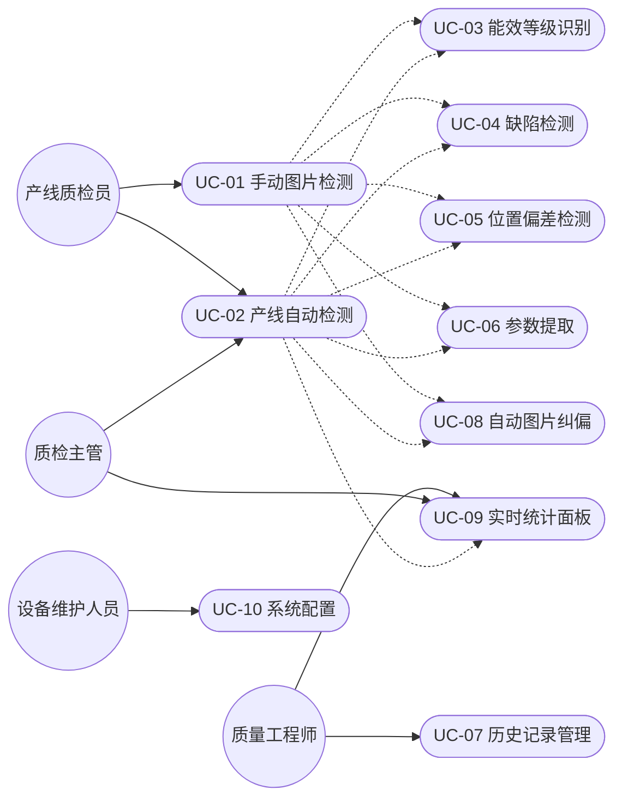

# MyGo 能效标签与缺陷检测系统 — 需求分析文档

## 文档信息

| 项目 | 内容 |
|------|------|
| 项目名称 | MyGo 能效标签与缺陷检测系统 |
| 文档版本 | V2.0 |
| 编写日期 | 2026-04-19 |
| 文档状态 | 已完成 |

---

## 一、项目概述

### 1.1 项目背景

在工业生产制造过程中，产品能效标签的粘贴质量和信息准确性是产品合规上市的关键要素。根据国家《能源效率标识管理办法》，列入目录的用能产品必须加施能效标识，且标识信息必须真实、准确、清晰。

当前能效标签质检面临的核心问题：

1. **人工检测效率低下**：传统人工目视检测方式，单个产品检测需 20-40 秒，无法满足高速产线需求
2. **检测结果不一致**：不同检测人员对同一产品的判断可能存在差异，尤其在边界条件下
3. **数据记录困难**：纸质记录易丢失、难统计，无法支持质量趋势分析
4. **人力成本高企**：需要大量专职质检人员，且人员流动导致培训成本居高不下
5. **合规风险大**：标签不合规可能导致产品被强制下架，甚至面临行政处罚

### 1.2 项目目标

构建一套基于 OpenHarmony 国产操作系统的智能能效标签检测系统，利用深度学习技术实现标签的自动化质检，具体目标包括：

| 目标类别 | 目标描述 | 衡量指标 |
|----------|----------|----------|
| 功能目标 | 能效等级自动识别 | 支持 1-5 级识别，OCR"X级"优先 + HSV颜色备用 |
| 功能目标 | 标签缺陷检测 | 支持破损/污渍/褶皱 |
| 功能目标 | 位置偏差检测 | 像素级偏差计算，≤10% 为合格 |
| 功能目标 | OCR 参数提取 | PaddleOCR 文字识别与参数提取 |
| 功能目标 | 自动图片纠偏 | EXIF + 白底区域高度分析 |
| 功能目标 | 实时统计面板 | 检测总数、通过率、缺陷分布、平均耗时 |
| 性能目标 | 检测速度 | ≤ 5 秒/张 |
| 性能目标 | 等级识别准确率 | ≥ 85% |
| 性能目标 | 缺陷检出率 | ≥ 80% |
| 效益目标 | 人力成本降低 | 降低 60%-80% |
| 效益目标 | 检测效率提升 | 提升 5-10 倍 |

### 1.3 项目范围

#### 包含范围

- OpenHarmony 客户端应用开发（API 20 + ArkTS）
- Node.js Express 后端服务开发（sql.js SQLite）
- Python AI 检测引擎开发（YOLOv8 + PaddleOCR + OpenCV）
- YOLOv8 检测模型训练与部署
- 手动检测与产线自动检测双模式
- 历史数据管理与统计分析

#### 不包含范围

- 企业 ERP/MES 系统集成
- 多语言国际化
- 云端部署与多设备协同（规划中）

---

## 二、用户角色分析

| 角色 | 描述 | 核心需求 |
|------|------|----------|
| 产线质检员 | 生产线上的操作人员，负责日常标签检测 | 简单易用的检测操作界面，快速获取检测结论 |
| 质量工程师 | 质量管理体系人员，负责数据分析与追溯 | 历史数据追溯，缺陷趋势分析，数据导出 |
| 质检主管 | 产线管理与监控人员，负责质量把控 | 产线模式实时看板，统计分析报表，检测参数调整 |
| 设备维护人员 | IT 系统运维人员，负责设备维护 | 系统配置管理，网络摄像头维护，参数调优 |

---

## 三、用例分析

### 3.1 用例图

### 3.2 用例详细描述

#### UC-01 手动图片检测

| 属性 | 描述 |
|------|------|
| 用例编号 | UC-01 |
| 用例名称 | 手动图片检测 |
| 参与者 | 产线质检员 |
| 前置条件 | 系统已启动，后端服务正常运行 |
| 后置条件 | 检测记录已保存，结果已展示 |

**基本流程**：

1. 质检员打开应用，进入手动检测模式
2. 选择图片来源：
   - 从设备图库选择图片
   - 调用相机拍照
   - 使用预设测试图片
3. 系统自动对图片进行纠偏处理（EXIF 旋转 + 白底区域高度分析）
4. 系统将图片发送至后端 AI 引擎
5. AI 引擎执行检测：目标检测 → 缺陷判定 → 等级识别 → OCR 提取
6. 系统返回检测结果
7. 前端展示综合检测报告（等级、缺陷、位置、OCR 参数）
8. 系统自动保存检测记录

**异常流程**：

- 3a. 图片格式不支持：提示格式错误
- 4a. 网络异常：提示网络错误，支持重试
- 5a. 检测超时（>60s）：自动终止并提示超时
- 5b. 未检测到标签：返回"未检测到标签"提示
- 5c. 检测到缺陷：跳过等级检测，直接返回缺陷结果

#### UC-02 产线自动检测

| 属性 | 描述 |
|------|------|
| 用例编号 | UC-02 |
| 用例名称 | 产线自动检测 |
| 参与者 | 质检主管、产线质检员 |
| 前置条件 | 系统已启动，网络摄像头已连接 |
| 后置条件 | 所有检测记录已保存，统计数据已更新 |

**基本流程**：

1. 质检主管进入产线检测模式
2. 配置网络摄像头连接
3. 预览摄像头画面，确认拍摄区域
4. 配置拍照间隔参数（5/10/30/60 秒）
5. 点击"开始检测"启动自动检测
6. 系统按设定间隔自动拍照并检测
7. 实时更新统计看板（检测总数、通过率、缺陷分布、平均耗时）
8. 质检主管可随时暂停/恢复检测
9. 点击"结束检测"结束会话

**异常流程**：

- 2a. 摄像头连接失败：提示连接错误
- 6a. 单次检测失败：记录失败计数，继续下一张
- 6b. 摄像头断连：提示错误，支持自动重试

#### UC-03 能效等级识别

| 属性 | 描述 |
|------|------|
| 用例编号 | UC-03 |
| 用例名称 | 能效等级识别 |
| 参与者 | 系统（内部用例，由 UC-01/UC-02 触发） |
| 描述 | 识别能效标签的等级（1-5 级），优先使用 OCR 识别"X级"文字，失败时回退到 HSV 颜色分析 |

**等级识别策略**：

| 优先级 | 方法 | 描述 |
|--------|------|------|
| 1 | OCR 文字识别 | PaddleOCR 识别"X级"文字，置信度 > 0.8 时采用 |
| 2 | HSV 颜色分析 | 分析等级色条色调，5 种 ROI 策略自适应 |

**等级-色调映射**：

| 色调 H（OpenCV 0-180） | 等级 | 颜色 |
|------------------------|------|------|
| 0-12 / 168-180 | 5 级 | 红色 |
| 12-24 | 4 级 | 橙色 |
| 24-36 | 3 级 | 黄橙色 |
| 36-65 | 2 级 | 黄绿色 |
| 65-105 | 1 级 | 绿色 |

#### UC-04 缺陷检测

| 属性 | 描述 |
|------|------|
| 用例编号 | UC-04 |
| 用例名称 | 缺陷检测 |
| 参与者 | 系统（内部用例，由 UC-01/UC-02 触发） |
| 描述 | 检测标签表面的破损、污渍、褶皱缺陷 |

**缺陷类型定义**：

| 缺陷类型 | 标识 | 描述 |
|----------|------|------|
| 破损 | break | 标签表面破损、撕裂 |
| 污渍 | stain | 标签表面有污渍、污染 |
| 褶皱 | wrinkle | 标签表面有褶皱、起皱 |

**检测规则**：检测到任意缺陷时，判定为不合格，跳过等级检测。

#### UC-05 位置偏差检测

| 属性 | 描述 |
|------|------|
| 用例编号 | UC-05 |
| 用例名称 | 位置偏差检测 |
| 参与者 | 系统（内部用例，由 UC-01/UC-02 触发） |
| 描述 | 检测标签粘贴位置的像素级偏差并判定合规性 |

**判定规则**：

| 偏差范围 | 判定结果 |
|----------|----------|
| ≤ 10% | 合格（位置正确） |
| > 10% | 不合格（位置偏移） |

**输出信息**：中心坐标 (x, y)、偏差百分比、合规判定结果。

#### UC-06 参数提取

| 属性 | 描述 |
|------|------|
| 用例编号 | UC-06 |
| 用例名称 | 参数提取 |
| 参与者 | 系统（内部用例，由 UC-01/UC-02 触发） |
| 描述 | 通过 PaddleOCR 提取标签上的文字参数 |

**提取内容**：

| 参数 | 格式 | 说明 |
|------|------|------|
| 能效参数 | X.X 格式数字 | 如"3.5" |
| 待机功率 | 文字识别 | 如"0.5W" |
| 能效等级文字 | "X级"格式 | 辅助等级判定 |

#### UC-07 历史记录管理

| 属性 | 描述 |
|------|------|
| 用例编号 | UC-07 |
| 用例名称 | 历史记录管理 |
| 参与者 | 质量工程师 |
| 前置条件 | 系统中存在历史检测记录 |
| 后置条件 | 无 |

**基本流程**：

1. 质量工程师进入历史记录页面
2. 设置筛选条件（产品型号、日期范围、检测状态：合格/不合格/全部）
3. 系统返回匹配的检测记录列表
4. 查看单条记录详情
5. 可选：查看统计图表（合格率、缺陷分布）
6. 可选：删除单条或全部记录
7. 可选：导出数据为 CSV 文件

#### UC-08 自动图片纠偏

| 属性 | 描述 |
|------|------|
| 用例编号 | UC-08 |
| 用例名称 | 自动图片纠偏 |
| 参与者 | 系统（内部用例，由 UC-01/UC-02 触发） |
| 描述 | 自动纠正图片方向偏差，确保后续检测的准确性 |

**纠偏策略**：

| 策略 | 描述 |
|------|------|
| EXIF 旋转 | 根据图片 EXIF 信息中的方向标记旋转图片 |
| 白底区域高度分析 | 分析图片中白底区域的高度分布，判断并纠正倾斜 |

#### UC-09 实时统计面板

| 属性 | 描述 |
|------|------|
| 用例编号 | UC-09 |
| 用例名称 | 实时统计面板 |
| 参与者 | 质检主管、质量工程师 |
| 描述 | 实时展示检测统计数据 |

**统计指标**：

| 指标 | 描述 |
|------|------|
| 检测总数 | 当前会话/累计检测的总数量 |
| 通过率 | 合格数 / 总数 × 100% |
| 缺陷分布 | 各类缺陷（破损/污渍/褶皱）的数量分布 |
| 平均耗时 | 单次检测的平均处理时间 |

#### UC-10 系统配置

| 属性 | 描述 |
|------|------|
| 用例编号 | UC-10 |
| 用例名称 | 系统配置 |
| 参与者 | 设备维护人员 |
| 前置条件 | 系统已启动 |
| 后置条件 | 配置参数已保存并生效 |

**基本流程**：

1. 设备维护人员进入系统设置页面
2. 配置检测参数（精度 50%-95%、速度 30%-90%）
3. 配置后端服务器地址
4. 配置产线参数（拍照间隔 5/10/30/60 秒）
5. 查看应用版本和设备信息
6. 保存配置

---

## 四、功能需求规格

### 4.1 功能需求矩阵

| 需求编号 | 功能名称 | 优先级 | 关联用例 | 状态 |
|----------|----------|--------|----------|------|
| FR-01 | 手动图片检测 | P0 | UC-01 | 已实现 |
| FR-02 | 产线自动检测 | P0 | UC-02 | 已实现 |
| FR-03 | 能效等级识别 | P0 | UC-03 | 已实现 |
| FR-04 | 缺陷检测 | P0 | UC-04 | 已实现 |
| FR-05 | 位置偏差检测 | P1 | UC-05 | 已实现 |
| FR-06 | 参数提取 | P1 | UC-06 | 已实现 |
| FR-07 | 历史记录管理 | P1 | UC-07 | 已实现 |
| FR-08 | 自动图片纠偏 | P1 | UC-08 | 已实现 |
| FR-09 | 实时统计面板 | P1 | UC-09 | 已实现 |

### 4.2 功能需求详细描述

#### FR-01 手动图片检测

| 属性 | 描述 |
|------|------|
| 需求编号 | FR-01 |
| 需求名称 | 手动图片检测 |
| 优先级 | P0（必须实现） |
| 描述 | 用户通过手动选择图片或拍摄照片的方式触发检测 |

子需求清单：

| 子编号 | 子功能 | 描述 | 验收标准 |
|--------|--------|------|----------|
| FR-01-01 | 图库选择 | 从设备相册选择图片 | 可正常选择并加载图片 |
| FR-01-02 | 相机拍照 | 调用设备相机拍摄标签照片 | 可正常拍摄并获取图片 |
| FR-01-03 | 测试图片 | 提供预设测试图片 | 可加载并检测所有测试图片 |
| FR-01-04 | 实时分析 | 上传后实时分析图片 | 分析结果在 5 秒内返回 |
| FR-01-05 | 结果展示 | 展示完整检测报告 | 包含等级、缺陷、位置、OCR |

#### FR-02 产线自动检测

| 属性 | 描述 |
|------|------|
| 需求编号 | FR-02 |
| 需求名称 | 产线自动检测 |
| 优先级 | P0 |
| 描述 | 产线自动定时拍照检测，含网络摄像头预览、定时拍照、开始/暂停/结束控制、实时统计 |

| 子编号 | 子功能 | 描述 | 验收标准 |
|--------|--------|------|----------|
| FR-02-01 | 摄像头预览 | 网络摄像头画面实时预览 | 可正常显示摄像头画面 |
| FR-02-02 | 定时拍照 | 按间隔自动拍照 | 支持 5/10/30/60 秒间隔 |
| FR-02-03 | 自动检测 | 拍照后自动触发检测 | 无需人工干预 |
| FR-02-04 | 开始/暂停/结束 | 检测会话控制 | 支持暂停恢复和终止 |
| FR-02-05 | 实时统计 | 检测数据实时更新 | 总数、通过率、缺陷分布、平均耗时 |

#### FR-03 能效等级识别

| 属性 | 描述 |
|------|------|
| 需求编号 | FR-03 |
| 需求名称 | 能效等级识别 |
| 优先级 | P0 |
| 描述 | 自动识别 1-5 级能效等级，OCR"X级"优先，HSV 颜色分析备用 |

| 子编号 | 子功能 | 描述 | 验收标准 |
|--------|--------|------|----------|
| FR-03-01 | OCR 等级识别 | PaddleOCR 识别"X级"文字 | 置信度 > 0.8 时采用 |
| FR-03-02 | HSV 颜色分析 | HSV 颜色空间色调分析 | 至少 5 种 ROI 策略回退 |
| FR-03-03 | 等级判定 | 综合判定 1-5 级 | 准确率 ≥ 85% |
| FR-03-04 | 置信度输出 | 输出识别置信度 | 0-1 之间的数值 |

#### FR-04 缺陷检测

| 属性 | 描述 |
|------|------|
| 需求编号 | FR-04 |
| 需求名称 | 缺陷检测 |
| 优先级 | P0 |
| 描述 | 检测标签表面的破损（break）、污渍（stain）、褶皱（wrinkle）缺陷 |

| 子编号 | 子功能 | 描述 | 验收标准 |
|--------|--------|------|----------|
| FR-04-01 | 破损检测 | 检测标签破损 | 检出率 ≥ 80% |
| FR-04-02 | 污渍检测 | 检测标签污渍 | 检出率 ≥ 80% |
| FR-04-03 | 褶皱检测 | 检测标签褶皱 | 检出率 ≥ 80% |
| FR-04-04 | 多缺陷 | 同时检测多种缺陷 | 支持单张多种缺陷同时检出 |

#### FR-05 位置偏差检测

| 属性 | 描述 |
|------|------|
| 需求编号 | FR-05 |
| 需求名称 | 位置偏差检测 |
| 优先级 | P1 |
| 描述 | 检测标签粘贴位置的像素级偏差，≤10% 为合格 |

| 子编号 | 子功能 | 描述 | 验收标准 |
|--------|--------|------|----------|
| FR-05-01 | 中心定位 | 计算标签中心坐标 | 像素级精度 |
| FR-05-02 | 偏差计算 | 计算偏移百分比 | 精确到 0.1% |
| FR-05-03 | 合规判定 | 偏差 ≤10% 为合规 | 判定准确 |

#### FR-06 参数提取

| 属性 | 描述 |
|------|------|
| 需求编号 | FR-06 |
| 需求名称 | 参数提取 |
| 优先级 | P1 |
| 描述 | 通过 PaddleOCR 技术提取标签文字参数 |

| 子编号 | 子功能 | 描述 | 验收标准 |
|--------|--------|------|----------|
| FR-06-01 | 文字识别 | PaddleOCR 识别标签文字 | 中文识别正常 |
| FR-06-02 | 能效参数 | 提取能效参数 | 提取 X.X 格式数字 |
| FR-06-03 | 待机功率 | 提取待机功率 | 正确提取 |
| FR-06-04 | 等级辅助 | OCR 辅助等级判定 | "X级"文字识别 |

#### FR-07 历史记录管理

| 属性 | 描述 |
|------|------|
| 需求编号 | FR-07 |
| 需求名称 | 历史记录管理 |
| 优先级 | P1 |
| 描述 | 检测记录的筛选、统计、删除、CSV 导出 |

| 子编号 | 子功能 | 描述 | 验收标准 |
|--------|--------|------|----------|
| FR-07-01 | 自动记录 | 自动保存检测记录 | 每次检测自动保存 |
| FR-07-02 | 条件筛选 | 多维度筛选记录 | 产品型号+日期+状态 |
| FR-07-03 | 统计分析 | 合格率/缺陷分布分析 | 图表展示 |
| FR-07-04 | 记录删除 | 删除单条或全部记录 | 删除后数据不可恢复 |
| FR-07-05 | CSV 导出 | 导出 CSV 文件 | 标准格式可用 Excel 打开 |

#### FR-08 自动图片纠偏

| 属性 | 描述 |
|------|------|
| 需求编号 | FR-08 |
| 需求名称 | 自动图片纠偏 |
| 优先级 | P1 |
| 描述 | 自动纠正图片方向偏差（EXIF 旋转 + 白底区域高度分析） |

| 子编号 | 子功能 | 描述 | 验收标准 |
|--------|--------|------|----------|
| FR-08-01 | EXIF 旋转 | 根据 EXIF 方向信息旋转图片 | 正确处理 8 种 EXIF 方向 |
| FR-08-02 | 白底分析 | 分析白底区域高度分布纠正倾斜 | 有效纠正小角度倾斜 |

#### FR-09 实时统计面板

| 属性 | 描述 |
|------|------|
| 需求编号 | FR-09 |
| 需求名称 | 实时统计面板 |
| 优先级 | P1 |
| 描述 | 实时展示检测统计数据（检测总数、通过率、缺陷分布、平均耗时） |

| 子编号 | 子功能 | 描述 | 验收标准 |
|--------|--------|------|----------|
| FR-09-01 | 检测总数 | 统计当前检测总数 | 实时更新 |
| FR-09-02 | 通过率 | 统计合格率 | 百分比显示 |
| FR-09-03 | 缺陷分布 | 各类缺陷数量分布 | 按缺陷类型分类 |
| FR-09-04 | 平均耗时 | 单次检测平均时间 | 秒为单位 |

---

## 五、非功能需求

### 5.1 性能需求

| 编号 | 需求描述 | 目标值 |
|------|----------|--------|
| NFR-P01 | 单次检测响应时间 | ≤ 5 秒 |
| NFR-P02 | YOLO 推理时间 | ≤ 2 秒 |
| NFR-P03 | 界面响应时间 | ≤ 1 秒 |
| NFR-P04 | 能效等级识别准确率 | ≥ 85% |
| NFR-P05 | 缺陷检出率 | ≥ 80% |
| NFR-P06 | 产线模式连续运行时间 | ≥ 8 小时 |

### 5.2 可靠性需求

| 编号 | 需求描述 | 目标值 |
|------|----------|--------|
| NFR-R01 | 系统可用性 | ≥ 99% |
| NFR-R02 | 检测超时保护 | 60 秒自动终止 |
| NFR-R03 | 临时文件清理 | 检测完成后自动清理 |
| NFR-R04 | 错误恢复 | 检测失败后可继续下一张 |
| NFR-R05 | 常驻服务回退 | detect_server 连接失败时自动回退 spawn 模式 |

### 5.3 安全性需求

| 编号 | 需求描述 | 目标值 |
|------|----------|--------|
| NFR-S01 | 数据传输 | HTTPS 加密传输 |
| NFR-S02 | 图片数据 | 检测后自动清理临时文件 |
| NFR-S03 | API 访问 | 内网部署，限制外部访问 |

### 5.4 兼容性需求

| 编号 | 需求描述 | 目标值 |
|------|----------|--------|
| NFR-C01 | 操作系统 | OpenHarmony API 20 |
| NFR-C02 | 设备类型 | 工业平板、手持终端 |
| NFR-C03 | 相机兼容 | 支持内置相机及网络摄像头 |

### 5.5 可维护性需求

| 编号 | 需求描述 | 目标值 |
|------|----------|--------|
| NFR-M01 | 代码注释率 | ≥ 20% |
| NFR-M02 | 模型可替换 | 支持热替换 YOLO 模型（best.pt） |
| NFR-M03 | 配置外置 | 关键参数可在设置页面配置 |

---

## 六、需求追踪矩阵

| 需求编号 | 用例 | 前端模块 | 后端模块 | AI 引擎 | 实现文件 |
|----------|------|----------|----------|---------|----------|
| FR-01 | UC-01 | Index.ets（手动模式） | detectionRoutes.js | detect_server.py | Index.ets, detectionService.js |
| FR-02 | UC-02 | Index.ets（产线模式） | detectionRoutes.js | webcam_server.py | Index.ets, detectionService.js |
| FR-03 | UC-03 | - | - | detect_server.py | detect_server.py |
| FR-04 | UC-04 | - | - | detect_server.py | detect_server.py |
| FR-05 | UC-05 | - | - | detect_server.py | detect_server.py |
| FR-06 | UC-06 | - | - | detect_server.py | detect_server.py |
| FR-07 | UC-07 | History.ets | historyRoutes.js | - | History.ets, historyService.js |
| FR-08 | UC-08 | - | - | detect_server.py | detect_server.py |
| FR-09 | UC-09 | History.ets / Index.ets | historyRoutes.js | - | History.ets, historyService.js |
