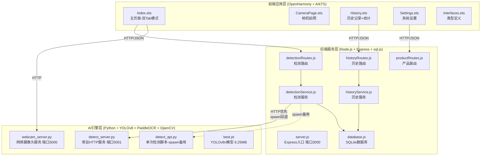
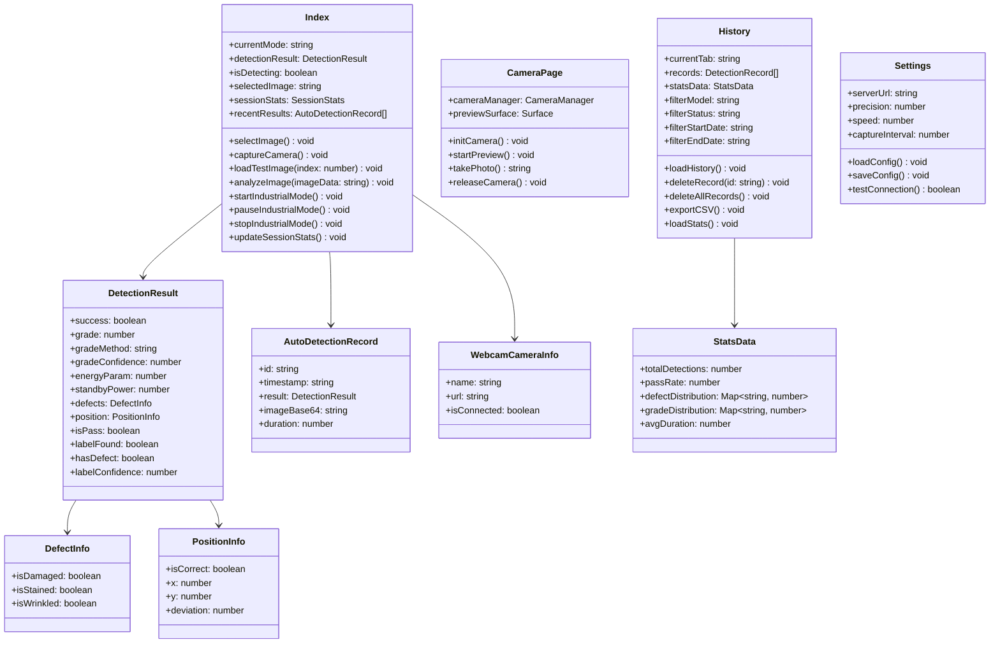
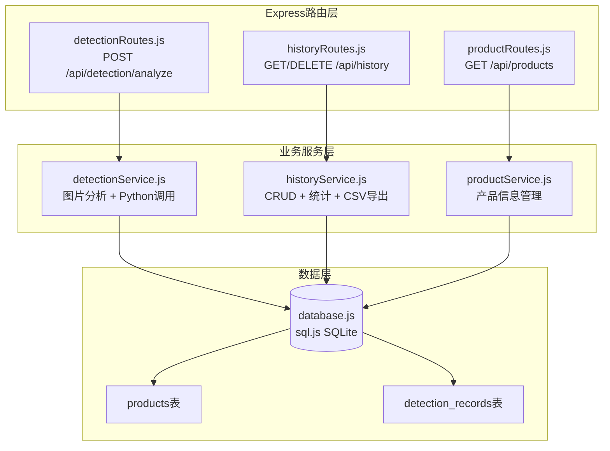
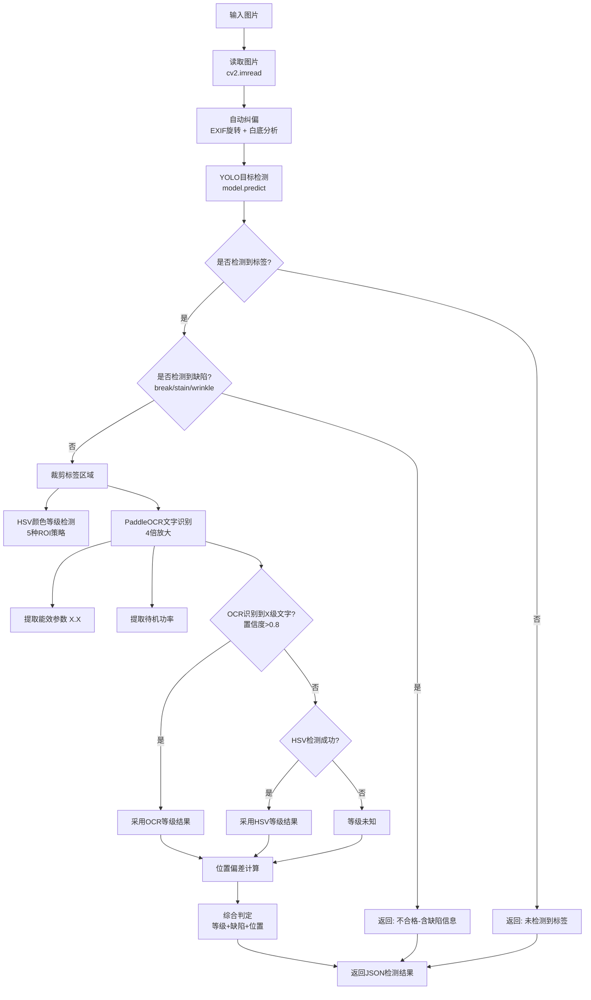
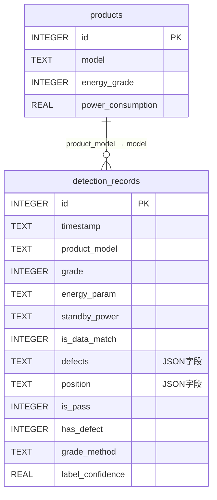
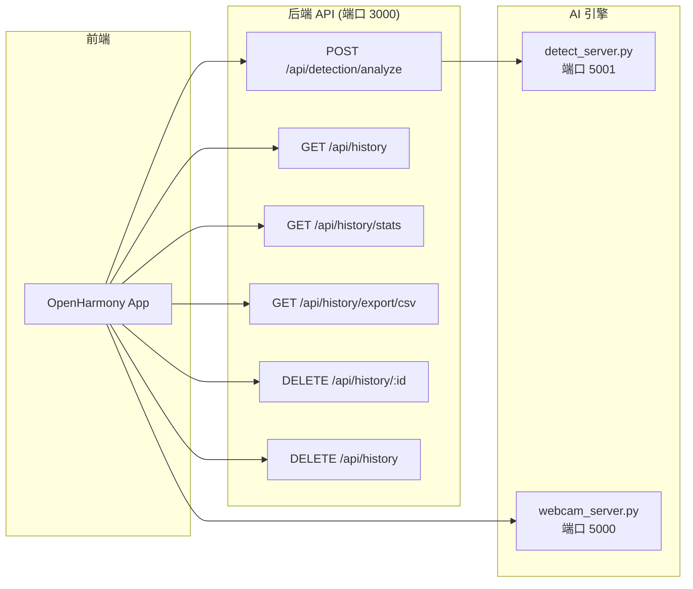
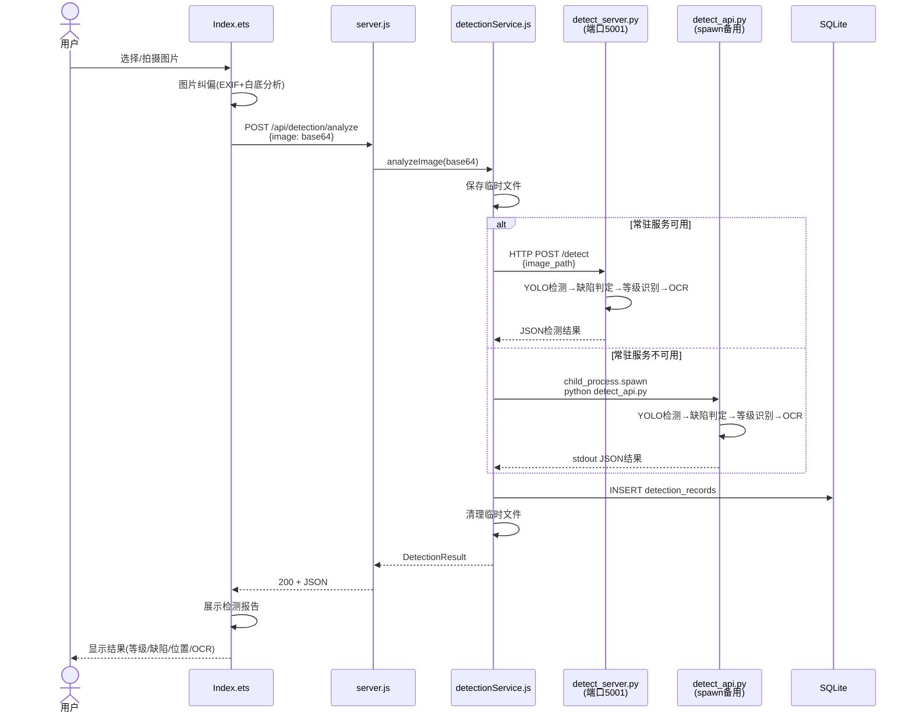
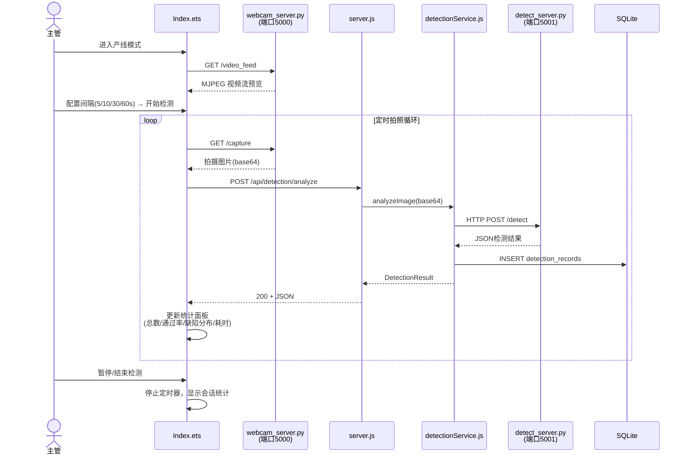
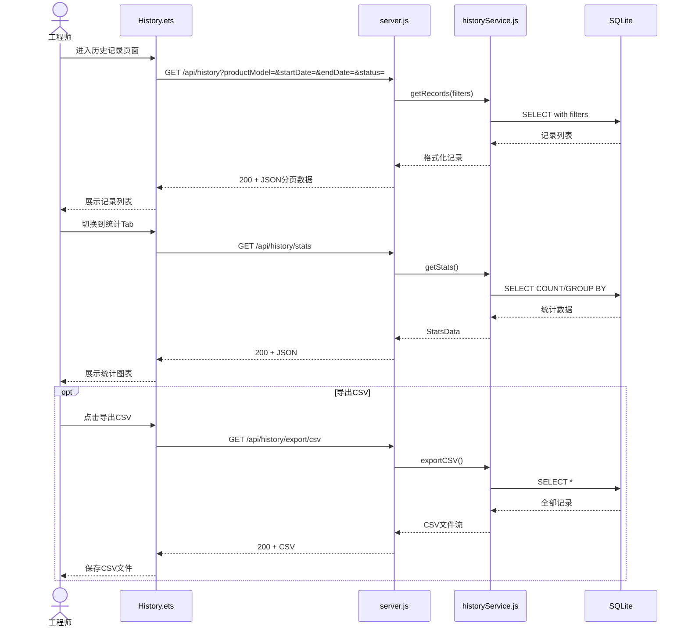

# MyGo 能效标签与缺陷检测系统 — 系统设计文档

## 文档信息

| 项目 | 内容 |
|------|------|
| 项目名称 | MyGo 能效标签与缺陷检测系统 |
| 文档版本 | V2.0 |
| 编写日期 | 2026-04-19 |
| 文档状态 | 已完成 |

---

## 一、系统架构设计

### 1.1 系统总体架构

本系统采用三层架构设计，分为前端应用层、后端服务层和 AI 引擎层。



### 1.2 架构设计原则

| 原则 | 说明 |
|------|------|
| 分层解耦 | 前端、后端、AI 引擎三层独立部署，通过标准 HTTP/JSON 接口通信 |
| 技术异构 | 前端 ArkTS + 后端 Node.js + AI 引擎 Python，各取所长 |
| 轻量部署 | YOLOv8n 模型仅 6.25MB，适合工业平板端部署 |
| 容错设计 | 常驻服务优先，spawn 回退，检测超时保护 |
| 数据持久化 | sql.js SQLite 本地存储，无需额外数据库服务 |

---

## 二、前端模块设计

### 2.1 模块结构

```
entry/src/main/ets/
├── common/
│   └── Interfaces.ets          # 类型定义
├── entryability/
│   └── EntryAbility.ets        # 应用入口
└── pages/
    ├── Index.ets               # 主页面（手动模式 + 产线模式双 Tab）
    ├── CameraPage.ets          # 相机拍照页面
    ├── History.ets             # 历史记录 + 统计分析双 Tab
    └── Settings.ets            # 系统设置页面
```

### 2.2 前端类图



---

## 三、后端模块设计

### 3.1 目录结构

```
backend/
├── src/
│   ├── server.js                    # Express 入口，端口 3000
│   ├── db/
│   │   └── database.js              # sql.js SQLite 初始化
│   ├── api/
│   │   ├── detectionRoutes.js       # 检测路由
│   │   ├── historyRoutes.js         # 历史路由（GET/DELETE）
│   │   └── productRoutes.js         # 产品路由
│   ├── services/
│   │   ├── detectionService.js      # 检测服务（调用Python）
│   │   └── historyService.js        # 历史服务（CRUD + 统计 + CSV）
│   └── python/
│       ├── detect_server.py         # 常驻HTTP服务，端口5001
│       ├── detect_api.py            # 单次检测脚本（spawn备用）
│       ├── webcam_server.py         # 网络摄像头服务，端口5000
│       └── best.pt                  # YOLOv8n模型权重
└── data/
    └── detection.db                 # SQLite数据库（运行时生成）
```

### 3.2 后端组件图



### 3.3 检测服务（detectionService.js）

检测服务是系统的核心模块，负责调用 Python AI 引擎执行检测。采用双重调用策略：

| 调用策略 | 描述 | 优势 |
|----------|------|------|
| 常驻服务模式 | HTTP 请求 detect_server.py（端口 5001） | 模型预加载，响应快，无需重复启动 |
| spawn 回退模式 | child_process.spawn 调用 detect_api.py | 无需额外启动服务，兼容性好 |

**调用流程**：

1. 优先尝试 HTTP 请求常驻服务（`http://localhost:5001/detect`）
2. 若常驻服务不可用，回退到 `child_process.spawn` 调用单次脚本
3. 解析返回的 JSON 结果
4. 自动存入历史记录
5. 清理临时文件
6. 60 秒超时保护

### 3.4 历史服务（historyService.js）

提供检测记录的完整生命周期管理：

| 功能 | 方法 | 描述 |
|------|------|------|
| 记录保存 | insertRecord() | 自动保存每次检测结果 |
| 条件查询 | getRecords(filters) | 支持型号、日期范围、状态筛选 |
| 单条删除 | deleteRecord(id) | 按 ID 删除单条记录 |
| 全部删除 | deleteAllRecords() | 清空所有记录 |
| 统计分析 | getStats() | 总数、通过率、缺陷分布、等级分布 |
| CSV 导出 | exportCSV() | 生成标准 CSV 格式文件 |

---

## 四、AI 引擎模块设计

### 4.1 引擎组件

| 组件 | 文件 | 端口 | 描述 |
|------|------|------|------|
| 常驻检测服务 | detect_server.py | 5001 | HTTP 服务，模型预加载，常驻内存 |
| 单次检测脚本 | detect_api.py | - | spawn 模式备用，单次执行后退出 |
| 网络摄像头服务 | webcam_server.py | 5000 | HTTP 服务，网络摄像头画面获取 |
| 模型权重 | best.pt | - | YOLOv8n 模型，6.25MB |

### 4.2 检测流程



### 4.3 YOLOv8 检测模型

**模型信息**：

| 属性 | 值 |
|------|------|
| 架构 | YOLOv8n（nano） |
| 模型文件 | best.pt |
| 模型大小 | 6.25 MB |
| 输入尺寸 | 640 × 640 |
| 检测类别 | label, nor, break, stain, wrinkle |
| 训练框架 | Ultralytics |
| 推理框架 | PyTorch |

**类别定义**：

| 类别名 | 标识 | 说明 |
|--------|------|------|
| label | 正常标签 | 能效标签正常粘贴 |
| nor | 正常标签（备选） | 训练标注差异产生的备选类 |
| break | 破损 | 标签表面破损/撕裂 |
| stain | 污渍 | 标签表面有污渍/污染 |
| wrinkle | 褶皱 | 标签表面有褶皱/起皱 |

---

## 五、数据库设计

### 5.1 ER 图



### 5.2 表结构详细设计

#### products 表

| 字段名 | 类型 | 约束 | 说明 |
|--------|------|------|------|
| id | INTEGER | PRIMARY KEY AUTOINCREMENT | 主键 |
| model | TEXT | NOT NULL | 产品型号 |
| energy_grade | INTEGER | | 能效等级（1-5） |
| power_consumption | REAL | | 功耗参数 |

#### detection_records 表

| 字段名 | 类型 | 约束 | 说明 |
|--------|------|------|------|
| id | INTEGER | PRIMARY KEY AUTOINCREMENT | 主键 |
| timestamp | TEXT | NOT NULL | 检测时间（ISO 格式） |
| product_model | TEXT | | 产品型号 |
| grade | INTEGER | | 识别的能效等级 |
| energy_param | TEXT | | 能效参数 |
| standby_power | TEXT | | 待机功率 |
| is_data_match | INTEGER | | 参数是否匹配（0/1） |
| defects | TEXT | | 缺陷信息 JSON |
| position | TEXT | | 位置信息 JSON |
| is_pass | INTEGER | | 是否合格（0/1） |
| has_defect | INTEGER | | 是否有缺陷（0/1） |
| grade_method | TEXT | | 等级识别方法（ocr/hsv） |
| label_confidence | REAL | | 标签置信度 |

**defects JSON 字段格式**：

```json
{
  "isDamaged": false,
  "isStained": true,
  "isWrinkled": false
}
```

**position JSON 字段格式**：

```json
{
  "isCorrect": true,
  "x": 320,
  "y": 240,
  "deviation": 3.5
}
```

---

## 六、API 接口设计

### 6.1 API 总览



### 6.2 接口详细设计

#### POST /api/detection/analyze

| 项目 | 说明 |
|------|------|
| 描述 | 接收 Base64 图片并调用 AI 引擎检测 |
| 请求体 | `{ "image": "data:image/jpeg;base64,..." }` |
| 成功响应 | 200 + DetectionResult JSON |
| 失败响应 | 400/500 + 错误信息 |

#### GET /api/history

| 项目 | 说明 |
|------|------|
| 描述 | 获取历史检测记录（支持筛选） |
| 查询参数 | `productModel`（型号）、`startDate`（起始日期）、`endDate`（结束日期）、`status`（合格/不合格） |
| 响应 | 200 + 分页记录列表 |

#### GET /api/history/stats

| 项目 | 说明 |
|------|------|
| 描述 | 获取检测统计数据 |
| 响应 | 200 + 统计对象（totalDetections, passRate, defectDistribution, avgDuration） |

#### GET /api/history/export/csv

| 项目 | 说明 |
|------|------|
| 描述 | 导出检测数据为 CSV 格式 |
| 响应 | 200 + CSV 文件流 |

#### DELETE /api/history/:id

| 项目 | 说明 |
|------|------|
| 描述 | 删除指定 ID 的检测记录 |
| 响应 | 200 + `{ "message": "删除成功" }` |

#### DELETE /api/history

| 项目 | 说明 |
|------|------|
| 描述 | 删除全部检测记录 |
| 响应 | 200 + `{ "message": "全部删除成功" }` |

---

## 七、关键时序图

### 7.1 手动检测时序图



### 7.2 产线自动检测时序图



### 7.3 历史记录查询时序图



---

## 八、安全设计

### 8.1 传输安全

- 生产环境启用 HTTPS
- API 接口限流防刷
- 文件上传限制 50MB

### 8.2 数据安全

- 临时图片检测后立即删除
- SQLite 数据库文件本地存储，不暴露到网络
- Base64 图片数据不在日志中记录

### 8.3 系统安全

- 内网部署，不暴露到公网
- Python 子进程超时保护（60 秒）
- 常驻服务异常时自动回退 spawn 模式

---

## 九、性能设计

### 9.1 前端性能

- 列表分页加载，避免大数据量渲染
- 图片压缩后再上传
- 检测结果本地缓存

### 9.2 后端性能

- Express 中间件 JSON 解析限制 50MB
- 检测结果内存缓存
- 常驻服务模式避免模型重复加载

### 9.3 AI 引擎性能

- YOLOv8n 轻量模型，推理时间 < 2 秒
- detect_server.py 模型预加载，常驻内存
- OCR 前 4 倍放大，平衡精度与性能
- HSV 分析纯 NumPy 运算，毫秒级完成

---

## 十、部署设计

### 10.1 硬件要求

| 组件 | 最低配置 | 推荐配置 |
|------|----------|----------|
| CPU | 4 核 | 8 核 |
| 内存 | 4 GB | 8 GB |
| 存储 | 2 GB | 10 GB |
| 相机 | 500 万像素 | 800 万像素以上 |

### 10.2 软件要求

| 组件 | 版本 |
|------|------|
| OpenHarmony | API 20 |
| Node.js | v18+ |
| Python | 3.8+ |
| YOLOv8 | ultralytics >= 8.0 |
| PaddleOCR | >= 2.6 |
| OpenCV | >= 4.5 |

### 10.3 服务端口规划

| 服务 | 端口 | 说明 |
|------|------|------|
| Express 后端 | 3000 | 主服务，API 路由入口 |
| AI 常驻检测服务 | 5001 | detect_server.py，模型预加载 |
| 网络摄像头服务 | 5000 | webcam_server.py，摄像头画面获取 |

### 10.4 网络配置

| 环境 | 后端地址 |
|------|----------|
| 开发（模拟器） | http://10.0.2.2:3000 |
| 开发（真机） | http://{PC_IP}:3000 |
| 生产 | http://{SERVER_IP}:3000 |
