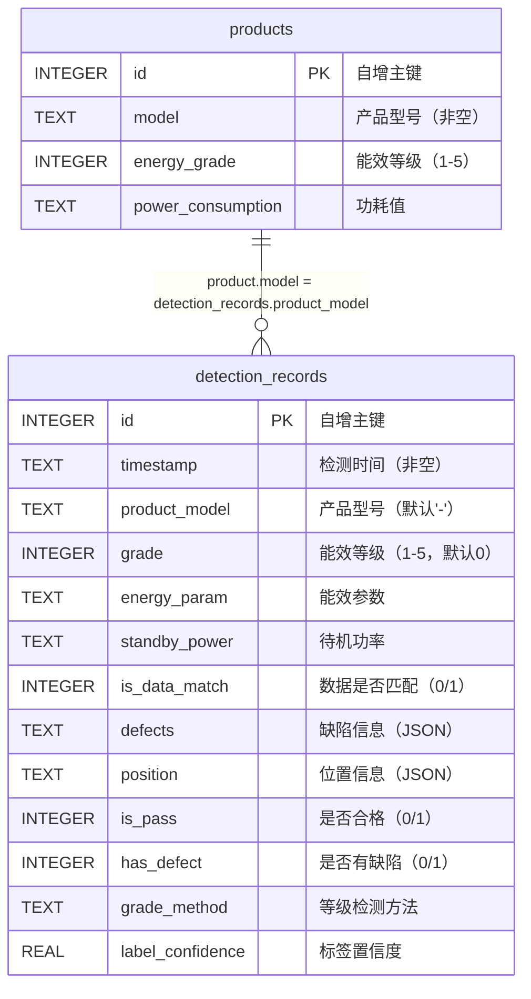

# MyGo 能效标签与缺陷检测系统 — 数据库设计文档

## 文档信息

| 项目 | 内容 |
|------|------|
| 项目名称 | MyGo 能效标签与缺陷检测系统 |
| 文档版本 | V2.0 |
| 编写日期 | 2026-04-19 |
| 文档状态 | 已完成 |

---

## 一、概述

### 1.1 存储方案

系统采用 **sql.js**（SQLite 编译为 WebAssembly）作为本地存储方案，数据持久化到文件 `backend/data/detection.db`。

### 1.2 方案选型

| 方案 | 说明 |
|------|------|
| sql.js（已采用） | SQLite 的 WebAssembly 实现，零依赖部署，数据存储为本地 .db 文件，支持完整 SQL 语法 |
| 内存数组（已弃用） | 开发阶段使用，数据在服务重启后丢失 |
| PostgreSQL（远期规划） | 适用于大规模服务器部署场景，预留扩展接口 |

### 1.3 设计原则

- 满足第三范式（3NF），减少数据冗余
- 支持高效查询和统计分析
- 本地文件持久化，服务重启数据不丢失
- 轻量部署，无需额外数据库服务

---

## 二、概念设计（ER 图）



---

## 三、逻辑设计（表结构）

### 3.1 产品表（products）

存储产品型号及其对应的能效参数基准数据。

| 字段名 | 数据类型 | 约束 | 说明 |
|--------|----------|------|------|
| id | INTEGER | PRIMARY KEY AUTOINCREMENT | 自增主键 |
| model | TEXT | NOT NULL | 产品型号 |
| energy_grade | INTEGER | | 能效等级（1-5） |
| power_consumption | TEXT | | 功耗值（如 "120W"） |

**建表 SQL**：

```sql
CREATE TABLE IF NOT EXISTS products (
  id INTEGER PRIMARY KEY AUTOINCREMENT,
  model TEXT NOT NULL,
  energy_grade INTEGER,
  power_consumption TEXT
);
```

**默认数据**：

```sql
INSERT INTO products (model, energy_grade, power_consumption) VALUES ('HB-2024-001', 1, '120W');
INSERT INTO products (model, energy_grade, power_consumption) VALUES ('HB-2024-002', 2, '150W');
INSERT INTO products (model, energy_grade, power_consumption) VALUES ('HB-2024-003', 3, '180W');
```

### 3.2 检测记录表（detection_records）

存储每次能效标签检测的完整结果数据。

| 字段名 | 数据类型 | 约束 | 说明 |
|--------|----------|------|------|
| id | INTEGER | PRIMARY KEY AUTOINCREMENT | 自增主键 |
| timestamp | TEXT | NOT NULL | 检测时间（格式：YYYY-MM-DD HH:mm:ss） |
| product_model | TEXT | DEFAULT '-' | 产品型号 |
| grade | INTEGER | DEFAULT 0 | 能效等级（1-5，0 表示未识别） |
| energy_param | TEXT | | 能效参数 |
| standby_power | TEXT | | 待机功率 |
| is_data_match | INTEGER | DEFAULT 0 | 数据是否匹配（0=不匹配，1=匹配） |
| defects | TEXT | | 缺陷信息（JSON 字符串） |
| position | TEXT | | 位置信息（JSON 字符串） |
| is_pass | INTEGER | DEFAULT 0 | 是否合格（0=不合格，1=合格） |
| has_defect | INTEGER | DEFAULT 0 | 是否有缺陷（0=无缺陷，1=有缺陷） |
| grade_method | TEXT | | 等级检测方法（color/ocr） |
| label_confidence | REAL | | 标签置信度（0.0-1.0） |

**建表 SQL**：

```sql
CREATE TABLE IF NOT EXISTS detection_records (
  id INTEGER PRIMARY KEY AUTOINCREMENT,
  timestamp TEXT NOT NULL,
  product_model TEXT DEFAULT '-',
  grade INTEGER DEFAULT 0,
  energy_param TEXT,
  standby_power TEXT,
  is_data_match INTEGER DEFAULT 0,
  defects TEXT,
  position TEXT,
  is_pass INTEGER DEFAULT 0,
  has_defect INTEGER DEFAULT 0,
  grade_method TEXT,
  label_confidence REAL
);
```

### 3.3 JSON 字段结构定义

#### defects 字段

存储标签缺陷检测结果，格式为 JSON 字符串：

```json
{
  "isDamaged": false,
  "isStained": false,
  "isWrinkled": false
}
```

| 字段 | 类型 | 说明 |
|------|------|------|
| isDamaged | boolean | 是否存在破损缺陷 |
| isStained | boolean | 是否存在污渍缺陷 |
| isWrinkled | boolean | 是否存在褶皱缺陷 |

#### position 字段

存储标签位置校验结果，格式为 JSON 字符串：

```json
{
  "isCorrect": true,
  "x": 100.5,
  "y": 200.3,
  "deviation": 3.2
}
```

| 字段 | 类型 | 说明 |
|------|------|------|
| isCorrect | boolean | 位置是否正确（偏差 ≤ 10%） |
| x | number | 标签中心 X 坐标 |
| y | number | 标签中心 Y 坐标 |
| deviation | number | 位置偏差百分比（精确到 0.1%） |

---

## 四、数据库模块架构

### 4.1 模块结构

```
backend/src/db/
└── database.js          # 数据库初始化与连接管理

backend/data/
└── detection.db         # SQLite 数据库文件（运行时生成）
```

### 4.2 数据库模块 API

```javascript
// database.js 导出接口
module.exports = {
  initDatabase(),  // 异步初始化数据库（加载 sql.js WASM、建表、插入默认数据）
  getDb(),         // 获取数据库实例（sql.js Database 对象）
  save(),          // 将内存数据持久化到 .db 文件
};
```

### 4.3 初始化流程

```
服务启动 (server.js)
    |
    v
initDatabase()
    |
    +-- 加载 sql.js WASM 引擎
    |
    +-- 检测 data/detection.db 文件
    |   +-- 存在 -> 读取文件内容加载数据库
    |   +-- 不存在 -> 创建空数据库
    |
    +-- 执行 CREATE TABLE IF NOT EXISTS（建表）
    |
    +-- 检查 products 表是否为空
    |   +-- 为空 -> 插入 3 条默认产品数据
    |
    +-- save() 持久化到文件
    |
    +-- 启动 Express 服务监听端口
```

---

## 五、数据持久化机制

### 5.1 写入策略

每次数据变更（INSERT/UPDATE/DELETE）后立即调用 `save()` 将数据库导出写入文件：

```javascript
// 写入流程
db.run('INSERT INTO ...');  // 操作内存数据库
save();                      // 导出为 Buffer，写入 detection.db 文件
```

### 5.2 读取策略

服务启动时从文件加载数据到内存，后续查询直接操作内存数据库：

```javascript
// 启动加载
const buffer = fs.readFileSync(DB_PATH);
db = new SQL.Database(buffer);  // 从文件加载到内存
```

### 5.3 数据一致性

- sql.js 在内存中操作，文件写入是原子性的（writeFileSync）
- 每次写操作后立即持久化，确保数据不丢失
- 异常退出时最多丢失最后一次未 save() 的操作

---

## 六、服务层数据访问

### 6.1 HistoryService 数据访问

| 方法 | SQL 操作 | 说明 |
|------|----------|------|
| addRecord() | INSERT INTO detection_records | 插入检测记录并 save() |
| getDetectionRecords() | SELECT + WHERE 动态拼接 | 支持型号、日期、状态过滤 |
| getDetectionRecordById() | SELECT WHERE id = ? | 按 ID 查询单条记录 |
| getStats() | 多条 COUNT 聚合查询 | 统计总数、合格率、缺陷分布 |
| exportDetectionRecords() | SELECT + CSV 拼接 | 导出为 CSV 格式 |
| deleteRecord() | DELETE FROM detection_records WHERE id = ? | 按 ID 删除记录并 save() |
| clearAllRecords() | DELETE FROM detection_records | 清空全部记录并 save() |

### 6.2 ProductService 数据访问

| 方法 | SQL 操作 | 说明 |
|------|----------|------|
| getProducts() | SELECT * FROM products | 获取全部产品 |
| getProductById() | SELECT WHERE id = ? | 按 ID 查询产品 |
| addProduct() | INSERT INTO products | 添加产品并 save() |
| updateProduct() | UPDATE products SET ... | 更新产品并 save() |
| deleteProduct() | DELETE FROM products | 删除产品并 save() |

### 6.3 DetectionService 数据访问

| 方法 | SQL 操作 | 说明 |
|------|----------|------|
| getDetectionResult() | SELECT ORDER BY id DESC LIMIT 1 | 获取最新检测结果 |

---

## 七、数据字典汇总

| 表名 | 中文名 | 字段数 | 记录量预估 |
|------|--------|--------|-----------|
| products | 产品表 | 4 | 100-1000 |
| detection_records | 检测记录表 | 13 | 1000-100000+ |

---

## 八、扩展规划

### 8.1 向 PostgreSQL 迁移

当前 sql.js 方案适用于单机部署。未来如需多客户端并发访问或更大规模数据，可迁移至 PostgreSQL：

- 替换 `database.js` 中的连接逻辑为 `pg` 驱动
- 服务层 SQL 语句已使用参数化查询，迁移成本低
- 需额外处理 JSON 字段的类型映射（TEXT -> JSONB）

### 8.2 索引优化

当前记录量较小，暂未添加索引。当 detection_records 超过 10000 条时，建议添加：

```sql
CREATE INDEX idx_records_timestamp ON detection_records(timestamp);
CREATE INDEX idx_records_product_model ON detection_records(product_model);
CREATE INDEX idx_records_is_pass ON detection_records(is_pass);
```
