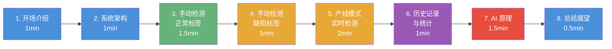
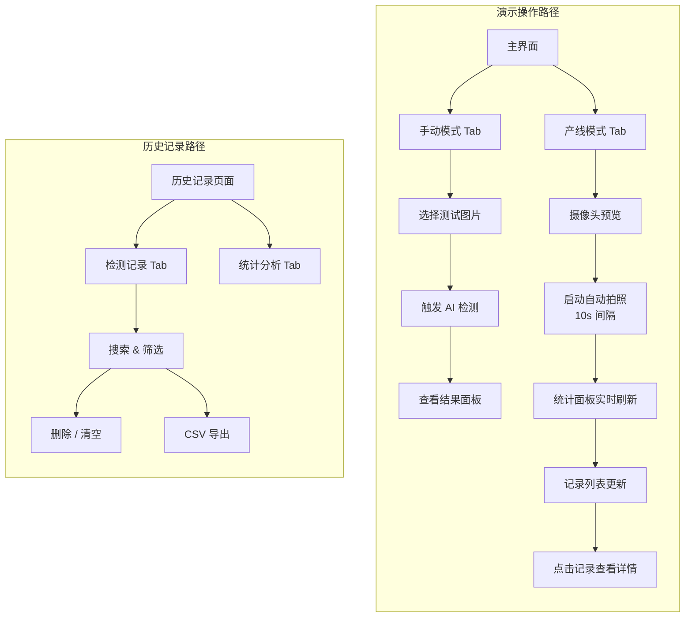
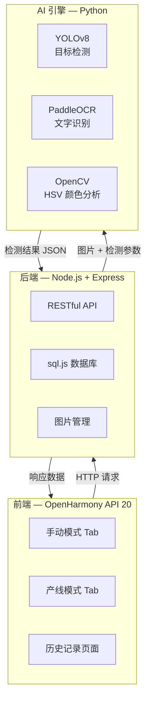
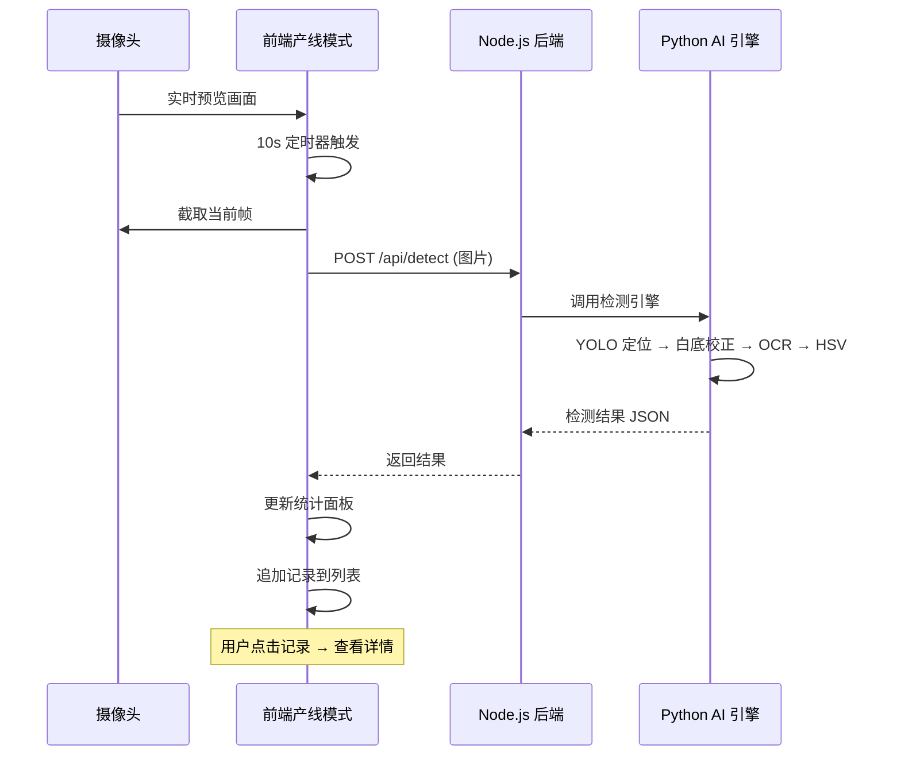
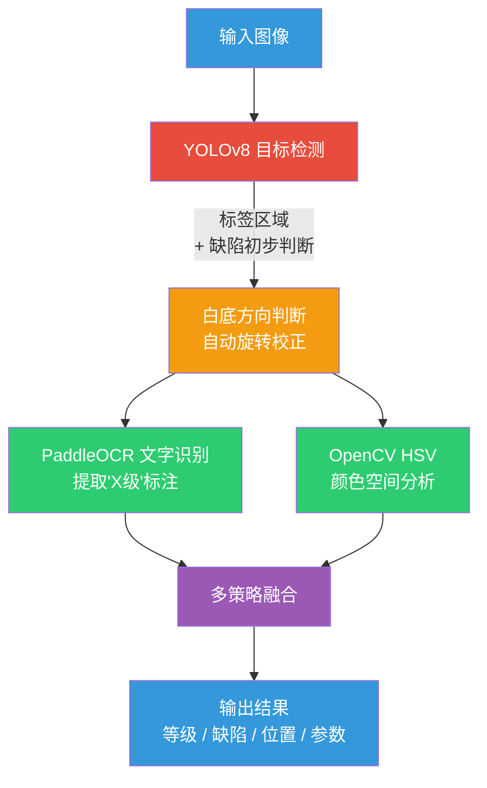

# MyGo 能效标签与缺陷检测系统 — 演示视频脚本

## 文档信息

| 项目 | 内容 |
|------|------|
| 项目名称 | MyGo 能效标签与缺陷检测系统 |
| 文档版本 | V2.0 |
| 编写日期 | 2026-04-19 |
| 建议时长 | 8-10 分钟 |

---

## 演示流程总览

---

## 一、视频制作要求

### 1.1 视频规格

| 项目 | 要求 |
|------|------|
| 分辨率 | 1920 x 1080（Full HD） |
| 帧率 | 30fps |
| 格式 | MP4（H.264 编码） |
| 音频 | 中文旁白 + 背景音乐 |
| 时长 | 8-10 分钟 |

### 1.2 录制工具建议

- 屏幕录制：OBS Studio / DevEco Studio 模拟器截图
- 旁白录制：Audacity / 手机录音
- 视频剪辑：剪映 / DaVinci Resolve
- 字幕：剪映自动字幕 + 手动校正

---

## 二、演示场景脚本

### 场景 1：开场与项目介绍（0:00 - 1:00）

**画面**：
- 深色背景，居中显示项目 Logo 和名称，动画渐入
- 快速闪过几张检测效果图（标签原图 + 检测结果叠加）

**旁白**：
> "大家好，欢迎观看 MyGo 能效标签与缺陷检测系统的项目演示。本系统基于 OpenHarmony API 20 国产操作系统开发前端界面，后端采用 Node.js 提供服务，AI 检测引擎由 Python 驱动，集成 YOLOv8 目标检测、PaddleOCR 文字识别和 OpenCV 图像处理三大核心技术，实现工业能效标签的自动化检测。"

**字幕/文字**：
- 主标题：MyGo 能效标签与缺陷检测系统
- 副标题：基于 OpenHarmony 的工业智能质检解决方案
- 技术栈：OpenHarmony API 20 | Node.js | Python AI (YOLOv8 + PaddleOCR + OpenCV)

---

### 场景 2：系统架构展示（1:00 - 2:00）

**画面**：
- 三层架构动画图（前端 → 后端 → AI 引擎）
- 各层技术栈标注
- 数据流向动画

**旁白**：
> "系统采用经典的三层架构设计。前端基于 OpenHarmony API 20 和 ArkTS 开发，运行在工业平板终端上，提供手动模式和产线模式双模式操作界面。后端使用 Node.js 和 Express 框架提供 RESTful API 服务，负责请求调度和数据管理。AI 检测引擎由 Python 驱动，集成 YOLOv8 目标检测定位标签区域、PaddleOCR 文字识别提取标签参数、OpenCV 进行 HSV 颜色空间分析判定能效等级。"

**字幕/文字**：
- 前端：OpenHarmony API 20 + ArkTS + ArkUI
- 后端：Node.js + Express + sql.js
- AI 引擎：Python + YOLOv8 + PaddleOCR + OpenCV

---

### 场景 3：手动检测演示 — 正常标签（2:00 - 3:30）

**画面**：
- 实际操作屏幕录制
- 打开 App → 手动模式 Tab → 选择测试图片 → 触发检测 → 查看结果

**旁白**：
> "首先演示手动检测模式。打开应用后，可以看到主界面顶部有手动模式和产线模式两个 Tab 标签，我们切换到手动模式。系统提供了内置的 13 张测试图片，覆盖 5 个能效等级以及各种缺陷类型。我们选择一张正常的三级能效标签图片进行检测。"

**操作步骤**：
1. 展示主界面，说明顶部双 Tab 切换（手动模式 / 产线模式）
2. 确认当前在手动模式 Tab
3. 浏览内置测试图片列表，说明覆盖范围
4. 选择一张正常的三级能效标签图片

**旁白（继续）**：
> "点击图片后，系统自动将图片发送到后端，调用 AI 引擎进行分析。YOLOv8 首先定位标签区域，然后通过白底方向判断自动旋转校正，接着 PaddleOCR 识别标签上的'X级'文字，同时 HSV 颜色分析作为备用策略，多策略融合后给出最终结果。整个过程大约 2-3 秒。可以看到，系统正确识别了能效等级、标签位置参数和各项指标。"

**操作步骤（继续）**：
5. 等待检测结果返回（展示加载过程）
6. 展示完整结果面板：能效等级、置信度、位置偏差、判定结果
7. 逐一说明各指标含义

**字幕/文字**：
- 检测方法：YOLO 定位 + 白底方向校正 + OCR 文字识别 + HSV 颜色备用
- 能效等级：3 级
- 标签位置偏差：合格范围内
- 综合6判定：合格

---

### 场景 4：手动检测演示 — 缺陷标签（3:30 - 4:30）

**画面**：
- 继续在手动模式中切换不同缺陷测试图片
- 依次展示破损、污渍、褶皱三种缺陷的检测结果

**旁白**：
> "接下来展示缺陷检测功能。系统支持检测三种常见标签缺陷：破损、污渍和褶皱。我们依次选择对应的测试图片。"

**操作步骤**：
1. 选择一张破损标签图片 → 展示检测结果，标注缺陷类型和位置
2. 选择一张污渍标签图片 → 展示检测结果
3. 选择一张褶皱标签图片 → 展示检测结果

**旁白（继续）**：
> "可以看到，系统在每次检测中不仅给出能效等级，还明确标注了缺陷类型和缺陷位置。当检测到缺陷时，系统自动将综合判定标记为不合格，便于质检人员快速定位问题。"

**字幕/文字**：
- 支持缺陷类型：破损 / 污渍 / 褶皱
- 检出缺陷时自动标记为不合格
- 显示缺陷位置信息

---

### 场景 5：产线模式演示 — 网络摄像头实时检测（4:30 - 6:30）

**画面**：
- 切换到产线模式 Tab
- 展示网络摄像头实时预览画面
- 启动自动拍照检测，展示统计面板和记录列表的实时更新

**旁白**：
> "现在切换到产线模式。这是专为工业产线连续检测设计的自动化模式。界面顶部同样通过 Tab 切换进入。产线模式首先展示网络摄像头的实时预览画面，我们可以看到摄像头已经连接。"

**操作步骤**：
1. 点击产线模式 Tab，切换界面
2. 展示网络摄像头实时预览画面

**旁白（继续）**：
> "系统默认以 10 秒间隔自动拍照检测。我们点击开始检测按钮，系统进入自动运行状态。每 10 秒自动采集一帧图像并发送到 AI 引擎分析。"

**操作步骤（继续）**：
3. 点击"开始检测"按钮
4. 等待至少 2-3 次自动拍照检测完成

**旁白（继续）**：
> "可以看到，每次检测完成后，上方的实时统计面板会自动刷新：检测总数、合格数量、不合格数量、合格率、平均处理时间等指标实时更新。下方的记录列表也会同步追加最新检测记录，每条记录显示时间、等级、缺陷信息和判定结果。点击任意一条记录，还可以查看该次检测的完整详情。"

**操作步骤（继续）**：
5. 展示统计面板数据更新过程（特写）
6. 展示记录列表实时追加过程
7. 点击一条记录，查看详情页

**字幕/文字**：
- 网络摄像头实时预览
- 10 秒间隔自动拍照检测
- 实时统计面板：总数 / 合格率 / 缺陷数 / 平均时间
- 记录列表实时更新
- 点击记录查看详情

---

### 场景 6：历史记录与统计（6:30 - 7:30）

**画面**：
- 切换到历史记录页面
- 展示检测记录和统计分析两个 Tab
- 演示搜索筛选、删除、CSV 导出等操作

**旁白**：
> "所有检测记录自动持久化存储到本地 SQLite 数据库。进入历史记录页面，可以看到页面内有检测记录和统计分析两个 Tab。在检测记录 Tab 中，支持按关键词搜索和条件筛选，快速定位目标记录。"

**操作步骤**：
1. 进入历史记录页面
2. 展示检测记录 Tab，浏览记录列表
3. 在搜索框输入关键词，展示筛选效果
4. 演示删除单条记录
5. 演示 CSV 导出功能

**旁白（继续）**：
> "切换到统计分析 Tab，可以看到合格率趋势、缺陷类型分布、能效等级分布等统计图表，帮助管理者全面掌握产线质检状况。"

**操作步骤（继续）**：
6. 切换到统计分析 Tab
7. 展示各类统计图表

**字幕/文字**：
- 本地 SQLite 持久化存储
- 检测记录 Tab：搜索 / 筛选 / 删除 / 清空 / CSV 导出
- 统计分析 Tab：合格率 / 缺陷分布 / 等级分布

---

### 场景 7：AI 检测原理（7:30 - 9:00）

**画面**：
- 检测流程动画图
- YOLO 检测框效果图
- 白底方向判断示意图
- OCR 识别结果
- HSV 颜色空间映射图

**旁白**：
> "下面详细讲解 AI 检测引擎的工作原理。系统采用多策略融合的检测流程，分为四个关键步骤。"

**旁白（步骤一）**：
> "第一步，YOLOv8 目标检测。使用轻量化的 YOLOv8n 模型，仅有约 6MB 大小，在工业平板端即可高效运行。模型负责在图像中定位标签区域，同时初步判断是否存在破损、污渍、褶皱等缺陷。"

**旁白（步骤二）**：
> "第二步，白底方向判断与自动旋转。检测到标签后，系统通过分析标签白色底面的方向特征，判断标签的旋转角度，并自动校正为正向。这一步确保后续 OCR 识别的准确性。"

**旁白（步骤三）**：
> "第三步，PaddleOCR 文字识别。在校正后的标签图像上，OCR 引擎提取文字信息，重点识别'一级''二级''三级'等能效等级标注文字，实现精确的等级判定。"

**旁白（步骤四）**：
> "第四步，HSV 颜色空间分析。作为备用策略，系统将标签图像转换到 HSV 颜色空间，根据能效等级对应的色条色调范围进行颜色匹配判定。当 OCR 识别置信度不足时，颜色分析结果作为补充。最终多策略融合给出可靠的检测结果。"

**字幕/文字**：
- Step 1: YOLOv8 标签定位 + 缺陷检测
- Step 2: 白底方向判断 → 自动旋转校正
- Step 3: PaddleOCR 识别"X级"文字
- Step 4: HSV 颜色分析（备用策略）
- 最终：多策略融合，给出等级 + 缺陷 + 位置 + 参数

---

### 场景 8：总结与展望（9:00 - 9:30）

**画面**：
- 项目亮点总结动画
- 团队信息

**旁白**：
> "MyGo 能效标签与缺陷检测系统，将 YOLOv8、PaddleOCR、OpenCV 等 AI 技术与 OpenHarmony 国产操作系统深度结合，实现了工业能效标签的全自动化智能检测。系统支持手动和产线双模式，内置 13 张覆盖全场景的测试图片，具备完整的检测记录管理和统计分析功能。未来我们将持续优化模型精度，探索云端部署和多设备协同方案。感谢观看！"

**字幕/文字**：
- 核心亮点：
  - 国产平台：OpenHarmony API 20 深度适配
  - 双模式设计：手动检测 + 产线自动检测
  - 多模型融合：YOLOv8 + PaddleOCR + OpenCV
  - 轻量化部署：YOLOv8n 仅 6MB
  - 完整数据管理：SQLite 持久化 + 统计分析 + CSV 导出
- 团队：MyGo

---

## 三、演示时间分配

| 场景 | 内容 | 时长 | 累计 |
|------|------|------|------|
| 1 | 开场与项目介绍 | 60s | 1:00 |
| 2 | 系统架构展示 | 60s | 2:00 |
| 3 | 手动检测演示 — 正常标签 | 90s | 3:30 |
| 4 | 手动检测演示 — 缺陷标签 | 60s | 4:30 |
| 5 | 产线模式演示 — 实时检测 | 120s | 6:30 |
| 6 | 历史记录与统计 | 60s | 7:30 |
| 7 | AI 检测原理 | 90s | 9:00 |
| 8 | 总结与展望 | 30s | 9:30 |
| **合计** | | **9 分 30 秒** | |

---

## 四、录制注意事项

1. **环境准备**：确保 Node.js 后端服务和 Python AI 引擎环境正常运行，提前测试一次完整检测流程
2. **测试数据**：使用 13 张内置测试图片（覆盖 5 个等级 + 3 种缺陷 + 位置偏移），逐一验证每张图片的检测结果
3. **模拟器设置**：DevEco Studio 模拟器分辨率设置为 1920 x 1080
4. **网络摄像头**：产线模式演示前确保网络摄像头已连接且画面正常
5. **网络稳定**：确保前后端通信畅通，避免录制时请求超时
6. **分段录制**：每个场景可单独录制，后期拼接，降低单次录制失误风险
7. **旁白质量**：语速适中，咬字清晰，后期可添加字幕辅助
8. **背景音乐**：选择轻柔的科技风格背景音乐，音量低于旁白 20% 以上
